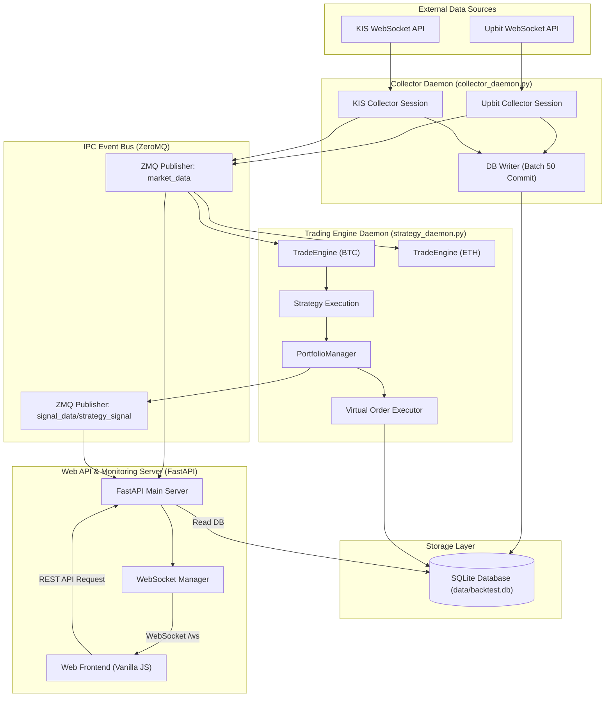
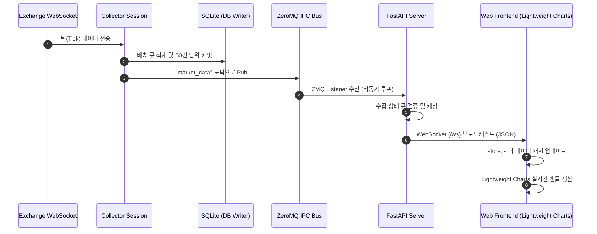
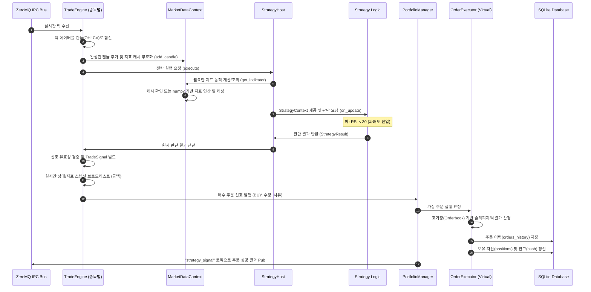

# Multi-Market Real-time Trading System 아키텍처

이 문서는 다중 시장(가상자산, 국내 주식 등)의 실시간 데이터를 수집, 저장하고 백테스트 및 실시간 가상 매매(Trade Simulation)를 수행하는 시스템 아키텍처 명세입니다.

---

## 1. 거시적 시스템 구조 (Macro System View)

전체 시스템은 비동기 이벤트 루프와 프로세스 간 통신(ZMQ IPC)을 기반으로 독립된 데몬 형태로 구성되어 있습니다. 데이터 수집 데몬(Collector)과 매매 전략 데몬(Strategy/Simulation)이 분리되어 있어 특정 모듈의 장애가 전체로 파급되지 않습니다.



---

## 2. 미시적 데이터 및 제어 흐름 (Micro View)

### 2.1. 실시간 시세 수집 및 차트 갱신 시퀀스
외부 거래소로부터 체결 틱 데이터가 유입되어 데이터베이스에 쓰이고, 웹소켓을 거쳐 웹 브라우저 차트에 실시간 드로잉되는 흐름입니다.



---

### 2.2. 모의투자 매매 신호 및 체결 처리 시퀀스
실시간 데이터를 기반으로 전략(Strategy)이 매매 신호를 발생시키고, 가상 체결 엔진이 포트폴리오 자산을 갱신하는 흐름입니다.



---

## 3. 핵심 컴포넌트 구조

### 3.1. 거래소 수집기 및 데이터 정규화 (Collector & Adapters)
- **독립 구동**: `src/collector/upbit_ws.py` 등은 큐 기반의 독립 수집 세션을 통해 구동됩니다.
- **데이터 규격 일원화**: 거래소별 JSON/텍스트 스키마를 공통 내부 데이터 형태인 `Tick` 데이터로 통일(Normalize)합니다. 특히 한국투자증권(KIS)의 경우, 실시간 WebSocket 체결가(`H0STCNT0`) 데이터에서 제공하는 문자형 체결시간(`HHMMSS`)을 로컬 당일 날짜와 결합하여 서울 타임존 기준의 정수형 Unix Timestamp로 정밀하게 변환함으로써, 네트워크 지연 등으로 인한 분봉 경계면의 가격 및 거래량 데이터 왜곡을 방지합니다.
- **비동기 백필 기동**: 수집기 기동 시 과거 누락된 1분봉 동기화 작업이 실시간 수집 시작을 지연시키지 않도록 백필 작업을 `asyncio.create_task`로 비동기 실행하여 구동 즉시 실시간 데이터 수집을 병행합니다.
- **벌크 병합 백필 (Bulk Merged Backfill)**: 과거 누락 캔들을 채울 때 개별 틈새마다 요청을 쪼개지 않고, 전체 누락 타임스탬프의 `[min, max]` 단일 대형 구간을 계산하여 1회의 벌크 API 호출로 데이터를 수집하고, 이미 존재하는 데이터는 메모리 상에서 중복 필터링하여 저장함으로써 API 호출 횟수를 90% 이상 절감합니다.

### 3.2. 포트폴리오 관리자 및 체결 엔진 (PortfolioManager & Executor)
- **포트폴리오 격리**: 각 트레이딩 세션이나 백테스트 실행은 독립된 `portfolio_id`를 가져 충돌을 원천 차단합니다.
- **주문 체결 분리**: `OrderExecutor` 인터페이스를 통해 실제 API 주문(`KISExecutor`)과 모의 시뮬레이션 주문(`VirtualOrderExecutorAdapter`)을 완벽하게 교체할 수 있습니다. 어댑터는 생성 시 `fee_rate` 를 주입받아 수수료를 자동 적용합니다.

### 3.3. 지표 및 전략 계산기 (Indicators & Strategy)
- **웜업 프로토콜**: 실시간 매매 전략 구동 전, 데이터베이스에서 최근 N개의 틱 데이터를 읽어와 차트 지표의 초기 버퍼를 채우는 웜업(Warm-up) 단계를 거칩니다.
- **MarketDataContext 통합**: 지표 계산과 캔들 데이터 누적 책임을 `MarketDataContext`로 일원화하고, 각 전략(`StrategyHost`)은 공유된 컨텍스트를 주입받아 동적으로 계산하되 동일 시점의 요청은 캐싱하여 고속 반환하는 메커니즘을 사용합니다.
- **단기상승흐름 전략 (Short-Term Trend Momentum)**: 룰 기반 파라미터 변이 및 머신러닝 데이터의 행동 공간(Action Space) 다양성 강화를 위해 기존 평균회귀(Mean-reversion) 계열과 대조되는 추세추종 속성의 전략입니다. 해당 전략은 이평 정배열, RSI 강세 & 기울기(Slope) 상승, 볼린저 밴드 상단(98%) 돌파 시 매수 진입하며, 2.0% 고정 손절선, 2.5% 트레일링 스탑, 이평 데드 크로스, RSI 극단 과매수(80.0) 감지 시 청산하여 단기 추세를 회수합니다.

### 3.4. 초 단위 온디맨드 캔들(OHLCV) 조립 및 무한 스크롤(지연 로딩) 아키텍처
- **디스크 I/O 최적화**: 1초봉 등 초 단위 봉 데이터를 매초 디스크 DB에 쓰는 동작은 SQLite 환경에서 심각한 병목을 초래합니다. 따라서 DB에는 틱 데이터(`trades`)만 벌크 저장(50건 배치 커밋)하고, 캔들 데이터는 저장하지 않습니다.
- **온디맨드 실시간 Aggregation**: 프론트엔드가 특정 범위의 캔들을 요청할 때 백엔드 `/candles` API가 요청 범위 내 틱 데이터를 SQLite 인덱스 스캔을 통해 조회하고, 메모리 상에서 정규화된 초 단위 봉으로 즉석 조립(Aggregation)하여 즉시 반환합니다. 복합 인덱스(`idx_trades_exch_sym_time`) 최적화 덕분에 30분 단위 데이터(수만 건의 틱) 조립 속도가 13ms 수준으로 극도로 빠릅니다.
- **무한 스크롤 (지연 로딩)**: 프론트엔드 차트(Lightweight Charts)의 왼쪽 과거 끝단 도달 시, 백엔드에 과거 30분 단위 범위의 체결 데이터를 비동기로 추가 호출하는 지연 로딩(Lazy Loading) 방식으로 구동하여 브라우저의 초기 로딩 부하를 줄입니다.
- **실시간 롤윈도우 상태 보존**: 캔들 마감 시 메모리 절약을 위해 기본 500개로 캔들을 슬라이싱(`slice(-500)`)하여 유지하되, 사용자가 과거 데이터를 스크롤하여 탐색하는 중(AutoScroll OFF / Explorer Mode ON)에는 실시간 틱 유입으로 인한 과거 데이터 유실(Slicing)을 우회하는 예외 처리를 적용했습니다.

### 3.5. 사용자 명령 디스패처 및 감사 로그 (UserCommandDispatcher & Audit Log)
- **느슨한 결합 (Loose Coupling)**: FastAPI 웹 라우터(프론트엔드 API 진입점)와 핵심 도메인 모델(포트폴리오 관리자, ZMQ 제어 버스 등) 간의 직접적인 결합을 해제하기 위해 커맨드 패턴 기반의 `UserCommandDispatcher`를 도입했습니다.
- **단일 통제 진입점**: 모든 사용자 조작 액션(수집기 시작/중지, 전략 설정 갱신, 모의투자 세션 시작/종료/긴급 매도 등)은 `UserCommand` Enum 형태로 정의되며 `dispatch(command, payload)` 단일 메서드를 통해서만 전달됩니다.
- **감사 로그 시퀀스**: 명령 실행 시 `_REQUEST` 감사 로그를 데이터베이스에 즉각 선행 기록하고, 매핑된 비즈니스 핸들러(`handlers` 테이블)를 거쳐 성공 시 `_SUCCESS`, 실패 시 `_FAILED` 감사 로그를 자동으로 연계 적재합니다.
- **추적성 (Traceability)**: 개별 유저 액션이 기동될 때 생성되는 고유 `command_id`(UUID)를 `system_events` 테이블의 `context` 컬럼(JSON)에 박제하여, 하나의 요청으로 발생한 요청-성공-실패 생명주기 전체를 완벽히 역추적할 수 있습니다.

### 3.6. 머신러닝 데이터 레이어 및 변이 컴파일러 (Dataset Exporter & Feature Builder)
전략 파라미터의 변이 이력(DAG)과 실거래 성과를 결합하여 머신러닝 학습 모델로 변환하는 결정론적(Deterministic) 데이터 파이프라인입니다.
* **이벤트 버퍼링 및 Monotonic성 보장 (`EventBuffer`)**: 
  - 실시간으로 발생하는 전략 변이 및 성과 이벤트를 인메모리 버퍼에 락(Lock)을 획득하여 단조 증가(Monotonic) 시퀀스로 수집합니다.
  - 동일 밀리초 내 다중 이벤트 충돌을 차단하기 위해 단조 증가 타임스탬프와 마이크로 시퀀스 카운터를 인젝션한 `commit_timestamp`를 사용해 완전한 Total Ordering을 보장합니다.
* **Deterministic DAG Rebuilder 및 원자적 영속화 (`DatasetExporter`)**:
  - 배치 동기화 시점에 4단계 정렬 규칙(`created_at` → `event_priority` → `global_monotonic_id` → `commit_timestamp`)에 따라 이벤트를 엄격히 정렬하고 복합 키(`node_hash`, `event_type`, `timestamp_bucket`) 기반으로 멱등하게 병합하여 `mutation_graph.jsonl`에 기록합니다.
  - 디스크 쓰기 병목이나 프로세스 급사 시 데이터 유실/오염을 원천 차단하기 위해 임시 파일(`.tmp`) 쓰기 → `fsync` → `rename` 방식을 적용하고, 이종 파일시스템 이동 시 `Copy-Verify-Delete` Fallback을 수행합니다.
* **3-Tier Outcome 모델 적용**:
  - 학습 모델의 레이블 오염(Label Leakage) 및 인과적 혼동(Causal Confusion)을 방지하고자, 노드의 성과 유형을 실제 거래 성과(OBSERVED), 가상 추적 시뮬레이션 성과(ESTIMATED), 미관측 성과(MASKED)로 구분하여 각각 다른 Label Space 및 ROI 필드에 매핑합니다.
* **온디맨드 피처 컴파일 및 버전 캐싱 (`FeatureBuilder`)**:
  - Raw JSONL 데이터를 바탕으로 O(N) parent traversal을 수행하여 파생 피처(`parent_roi`, `historical_roi_trend`, `parent_param_deltas`)를 런타임에 동적으로 계산합니다.
  - 중복 연산을 제거하기 위해 LRU 캐시를 활용하되, 스냅샷 갱신 시 캐시 무효화(Invalidation)를 보장하기 위해 캐시 키에 `dataset_snapshot_id`를 전역 버전 토큰으로 바인딩하고 `visited` 셋을 활용해 무한 루프(Cycle) 유입을 DFS 가드로 이중 방어합니다.
* **모델 뷰 분리 (`DatasetLoader`)**:
  - 가공된 파생 피처들을 Tabular(Scikit-learn/XGBoost 등), Sequence(Time-series 모델), Graph(PyG Node/Edge List) 등 다양한 머신러닝 학습 요건에 맞게 즉시 변환해주는 어댑터 역할을 수행합니다.

### 3.7. 전략 의사결정 및 승격 제어 레이어 (GIRS & Promotion Queue)
- **GIRS 및 2-Tier 피처 계약 해시 가드**: 오프라인 배치 학습용 GNN 백본과 런타임 추론용 GIRS(`onnxruntime` 단독 탑재된 MLP Scorer) 레이어를 분리하고 `model_risk_score` 단일 출력 헤드만 탑재합니다. `uncertainty_score`는 Entropy 식(`(-p log_e(p) - (1-p) log_e(1-p)) / log_e(2)`)으로 파생 정규화하고, 파생 지표 순환 의존성을 차단하기 위해 **직전 확정 window의 frozen rank 또는 replay-confirmed rank 변동량**을 기반으로 `rank_stability` (EMA 적용)를 산출하며, $eps \approx 1e-9$를 활용한 분모 Zero-division 방지 및 모든 stability 성분을 `[0.0, 1.0]` 범위로 클립한 가중합 `stability_score = clip(0.6 * min(rank_stability, market, system) + 0.4 * mean(rank_stability, market, system), 0.0, 1.0)` 수식을 적용한 4중 지표 뷰를 구동합니다. 실시간 지연 및 feature poisoning을 방지하기 위해 **2-Stage Feature Contract Validation**을 구동해 NaN/inf, shape, dtype 검사뿐만 아니라 범위 초과 시 원본 raw_value 보존 및 clamp 메트릭(`clamp_count/ratio`)을 누적 적재하는 range check와 정규 장거래 시간(`market_session == regular_trading`)이면서 유동성 조건(최소 예상 틱/거래량 이상) 충족 시에만 zero-variance stale count를 누적하는 Cheap Check(Step 1)를 구동하고, 비동기 feature mean shift 감지 시 Level 2 Degrade로 처리하여 silent ML collapse를 원천 차단하며, 모든 점수 성분(`model_risk_score`, `fallback_risk_score`, `girs_promotion_score`, `fallback_promotion_score`, `final_promotion_score`)의 [0, 1] 범위 제한과 Fallback 단조성을 강제하는 **Score Scale Golden Test**로 정합성을 보장합니다.
- **점진적 격하 가드 (Staged Progressive Degradation)**: 피처 지터에 의한 거짓 양성(False Positive)을 막기 위해 z-score drift 기반의 **Statistical Drift Detection**을 수행하며, 국면 감지 시에는 **국면 확률 벡터 (Regime Probability Vector)** 형태로 수립하여 `rule_confidence > 0.8`일 때만 룰 국면 절대 오버라이드(absolute override)가 동작하고 미달 시에는 두 국면 확률 벡터를 가중 결합하여 적용합니다. 신뢰도 미달 시 대체되는 Rule-based Scorer는 volatility, drawdown, regime, liquidity (spread, 1-volume, 1-depth 로 가중 평균하여 '높을수록 위험'으로 방향성 일치) 4개 요소를 조합해 fallback_risk_score를 도출하여 가용성을 보장합니다.
- **FSM 큐 랭킹 및 배치 정정 (Lazy Replay Correction)**: 큐 디버깅 및 전이 안전성을 위해 Candidate $\rightarrow$ Scored $\rightarrow$ Ranked $\rightarrow$ Promotion(Pending, Locked, Rejected, Executed 4단계 세분화)으로 전이하는 **FSM 모델로 설계하되, 제안 노후화 및 상태 교착을 막기 위해 **생명주기 가드**를 적용합니다. `proposal_ttl` (max_queue_age) 만료 시 즉각 **`Expired` 상태로 강제 전이**하고, `PromotionLocked` 상태가 `promotion_lock_timeout` 초과 체류 시 즉각 **`PromotionRejected(reason="LOCK_TIMEOUT")`로 강제 복구 전이**하며, `PromotionRejected` 상태가 `rejected_max_age` 초과 정체 시 즉시 `Expired` 상태로 이동해 영구 격리(재진입 영구 차단)합니다. Rejected 상태에서의 전이 진동(Flapping)을 방지하기 위해 쿨다운 게이트($T_{\text{cooldown}}$)를 적용하고 복귀는 ScoredQueue 하나로만 결정론적으로 고정하며, Raw Event Log 테이블에 event_id(UUID) 및 sequence_no(단조증가)를 지정하고 (proposal_id, sequence_no) 또는 event_id에 Unique Constraint를 부여하여 중복 삽입 및 멱등 리플레이 오차를 방지합니다. 백그라운드에서는 **주기적 배치 윈도우(e.g., 10s)** 단위로 Replay를 가동하되 미세 랭킹 흔들림(Oscillation) 방지를 위해 이중 임계치 기반 **Hysteresis Override Rule**에 입각하여 오차를 정정합니다. 이때 Rank Drift 계산의 후보수 N 의존성을 제거하고 누락 예외를 줄이기 위해, 대상을 Fast와 Replay의 합집합($candidates = union(FastRank, ReplayRank)$, $N=len(candidates)$)으로 고정하고 누락 후보는 $missing\_rank = N+1$로 가드 처리하며, 개별 순위 차이를 분모 $N$으로 나누어 정규화하고 [0, 1] 범위로 clip한 **Normalised Weighted Rank Drift** 오차 수식($\text{drift} = \sum weight_i * \text{rank\_diff\_i} / \sum weight_i$, $\text{rank\_diff\_i} = \text{clip}(|RankFast - RankReplay| / \max(1, N), 0.0, 1.0)$, 가중치는 $\min(RankFast, RankReplay)$ 기준 적용)을 사용하되, $N=0$ 또는 가중치합 0일 시 $drift=0.0$ 및 `action = NOOP`으로 예외를 방어(empty guard)합니다. 의사결정 최종 결합은 **Single Decision Authority Rule** (Replay 부재 시 Sigmoid 스무딩 가중합 $\alpha = \text{sigmoid}(10 * (\text{stability\_score} - 0.5))$ 기반의 $\text{final\_promotion\_score} = \alpha * girs\_promotion\_score + (1 - \alpha) * fallback\_promotion\_score$ 충돌 해소 적용, 모든 점수는 `1 - risk` 변환된 promotion_score로 통일)에 입각하여 처리합니다.
- **모델 확률 및 Calibration 보증 (Validation & GNN Labeling)**: Phase 4 훈련 및 검증 시 Validation set 상에서 **Expected Calibration Error(ECE)** 및 **Brier Score** 평가 지표를 의무적으로 측정/기록하며, 확률 정합성 개선을 위해 **Platt Scaling** 또는 **Isotonic Regression**을 활용한 캘리브레이션 검증을 구동합니다. 캘리브레이션 검증 미달 시 `model_risk_score`는 확률이 아닌 랭킹용 **risk index**로 제한 사용하며 uncertainty는 의사 신뢰도로 제한 분류합니다. GNN 학습을 위한 `rollback_risk = 1` 정답 라벨은 적용 후 T시간 ROI 언더퍼폼, MDD 위반, 사용자 수동 롤백 및 shadow league 강등에 의거해 수립하며, 피처 생성 단계에서는 **Causal Data Leakage Guard**를 적용하여 미래 데이터의 누수를 원천 차단합니다.

---

## 4. 프로젝트 디렉토리 구조 (Directory Structure)

```
ATS/
├── docs/                      # 프로젝트 통합 문서 보관소
│   ├── adr/                   # 아키텍처 결정 기록 (Architecture Decision Records)
│   ├── agents/                # AI 에이전트 지침 및 이슈 대장
│   ├── manual/                # KIS 등 외부 거래소 API 연동 상세 매뉴얼
│   ├── architecture.md        # (본 문서) 시스템 아키텍처 명세
│   ├── api.md                 # REST API 및 WebSocket 명세
│   ├── database.md            # 데이터베이스 테이블 및 인덱스 명세
│   ├── frontend.md            # 프론트엔드 아키텍처 및 뷰-데이터 매핑 명세
│   ├── backtest-engine-design.md
│   ├── collector-design.md
│   └── ui-design.md
├── src/                       # 백엔드 핵심 파이썬 소스코드
│   ├── server/                # FastAPI 웹 API 서버 및 웹소켓 핸들러
│   ├── collector/             # 거래소별 데이터 수집 엔진
│   ├── database/              # SQLite 스키마 및 DB Writer 모듈
│   ├── engine/                # 캔들 변환, 지표 연산, 주문 매칭, 백테스트 엔진
│   ├── ipc/                   # ZeroMQ 기반 이벤트 버스 퍼블리셔/서브스크라이버
│   └── utils/                 # 로깅 및 공통 유틸리티
├── frontend/                  # Vanilla HTML/JS/CSS 기반 프론트엔드 리소스
│   ├── index.html             # 단일 페이지 대시보드 구조
│   ├── app.js                 # 프론트엔드 모듈 초기화 및 조율
│   └── style.css              # 다크 테마 기반 스타일시트
├── data/                      # 데이터베이스 등 파일 영속 영역
│   └── backtest.db            # SQLite 3 로컬 데이터베이스 파일
├── AGENTS.md                  # AI 에이전트 작업 가이드라인 및 DOD 규정
├── CONTEXT.md                 # 최상위 프로젝트 도메인 용어집
└── README.md                  # (신규 예정) 프로젝트 안내 및 통합 문서 인덱스 허브
```
