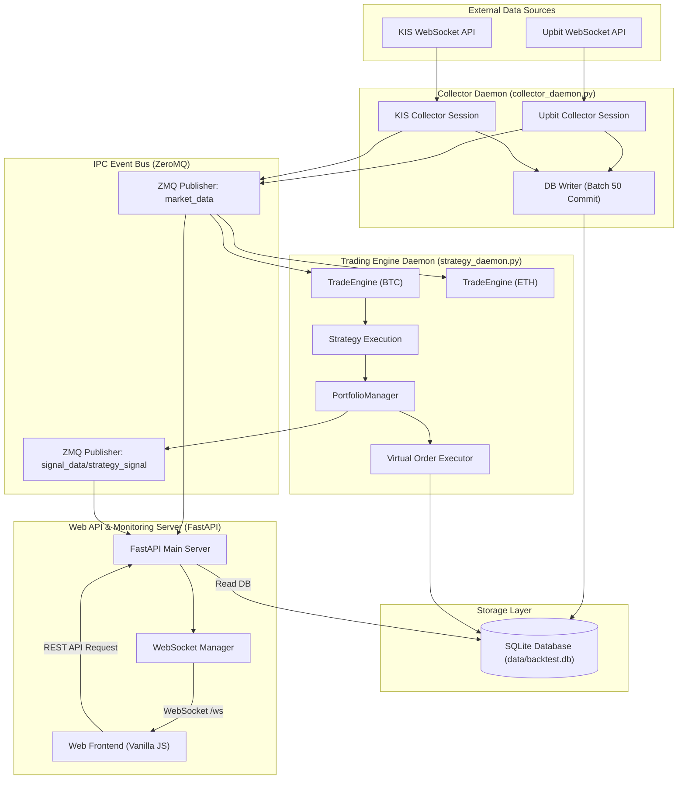
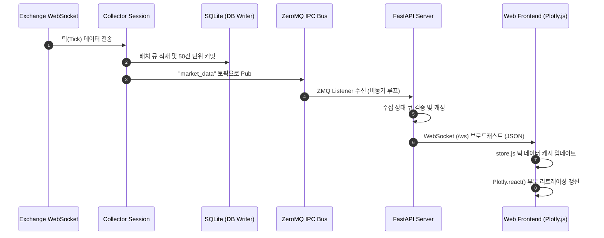
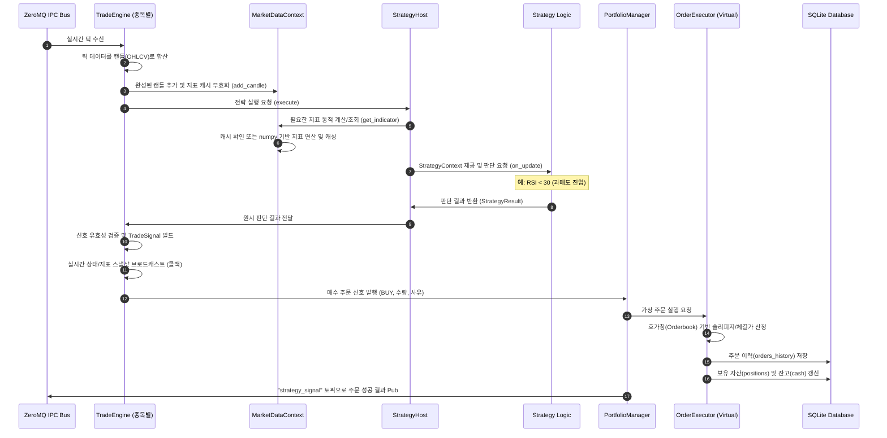

# Multi-Market Real-time Trading System 아키텍처

이 문서는 다중 시장(가상자산, 국내 주식 등)의 실시간 데이터를 수집, 저장하고 백테스트 및 실시간 가상 매매(Trade Simulation)를 수행하는 시스템 아키텍처 명세입니다.

---

## 1. 거시적 시스템 구조 (Macro System View)

전체 시스템은 비동기 이벤트 루프와 프로세스 간 통신(ZMQ IPC)을 기반으로 독립된 데몬 형태로 구성되어 있습니다. 데이터 수집 데몬(Collector)과 매매 전략 데몬(Strategy/Simulation)이 분리되어 있어 특정 모듈의 장애가 전체로 파급되지 않습니다.



---

## 2. 미시적 데이터 및 제어 흐름 (Micro View)

### 2.1. 실시간 시세 수집 및 차트 갱신 시퀀스
외부 거래소로부터 체결 틱 데이터가 유입되어 데이터베이스에 쓰이고, 웹소켓을 거쳐 웹 브라우저 차트에 실시간 드로잉되는 흐름입니다.



---

### 2.2. 모의투자 매매 신호 및 체결 처리 시퀀스
실시간 데이터를 기반으로 전략(Strategy)이 매매 신호를 발생시키고, 가상 체결 엔진이 포트폴리오 자산을 갱신하는 흐름입니다.



---

## 3. 핵심 컴포넌트 구조

### 3.1. 거래소 수집기 및 데이터 정규화 (Collector & Adapters)
- **독립 구동**: `src/collector/upbit_ws.py` 등은 큐 기반의 독립 수집 세션을 통해 구동됩니다.
- **데이터 규격 일원화**: 거래소별 JSON 스키마를 공통 내부 데이터 형태인 `Tick` 데이터로 통일(Normalize)합니다.

### 3.2. 포트폴리오 관리자 및 체결 엔진 (PortfolioManager & Executor)
- **포트폴리오 격리**: 각 트레이딩 세션이나 백테스트 실행은 독립된 `portfolio_id`를 가져 충돌을 원천 차단합니다.
- **주문 체결 분리**: `OrderExecutor` 인터페이스를 통해 실제 API 주문(`KISExecutor`)과 모의 시뮬레이션 주문(`VirtualOrderExecutorAdapter`)을 완벽하게 교체할 수 있습니다. 어댑터는 생성 시 `fee_rate` 를 주입받아 수수료를 자동 적용합니다.

### 3.3. 지표 및 전략 계산기 (Indicators & Strategy)
- **웜업 프로토콜**: 실시간 매매 전략 구동 전, 데이터베이스에서 최근 N개의 틱 데이터를 읽어와 차트 지표의 초기 버퍼를 채우는 웜업(Warm-up) 단계를 거칩니다.
- **MarketDataContext 통합**: 지표 계산과 캔들 데이터 누적 책임을 `MarketDataContext`로 일원화하고, 각 전략(`StrategyHost`)은 공유된 컨텍스트를 주입받아 동적으로 계산하되 동일 시점의 요청은 캐싱하여 고속 반환하는 메커니즘을 사용합니다.

---

## 4. 프로젝트 디렉토리 구조 (Directory Structure)

```
ATS/
├── docs/                      # 프로젝트 통합 문서 보관소
│   ├── adr/                   # 아키텍처 결정 기록 (Architecture Decision Records)
│   ├── agents/                # AI 에이전트 지침 및 이슈 대장
│   ├── manual/                # KIS 등 외부 거래소 API 연동 상세 매뉴얼
│   ├── architecture.md        # (본 문서) 시스템 아키텍처 명세
│   ├── api.md                 # REST API 및 WebSocket 명세
│   ├── database.md            # 데이터베이스 테이블 및 인덱스 명세
│   ├── frontend.md            # 프론트엔드 아키텍처 및 뷰-데이터 매핑 명세
│   ├── backtest-engine-design.md
│   ├── collector-design.md
│   └── ui-design.md
├── src/                       # 백엔드 핵심 파이썬 소스코드
│   ├── server/                # FastAPI 웹 API 서버 및 웹소켓 핸들러
│   ├── collector/             # 거래소별 데이터 수집 엔진
│   ├── database/              # SQLite 스키마 및 DB Writer 모듈
│   ├── engine/                # 캔들 변환, 지표 연산, 주문 매칭, 백테스트 엔진
│   ├── ipc/                   # ZeroMQ 기반 이벤트 버스 퍼블리셔/서브스크라이버
│   └── utils/                 # 로깅 및 공통 유틸리티
├── frontend/                  # Vanilla HTML/JS/CSS 기반 프론트엔드 리소스
│   ├── index.html             # 단일 페이지 대시보드 구조
│   ├── app.js                 # 프론트엔드 모듈 초기화 및 조율
│   └── style.css              # 다크 테마 기반 스타일시트
├── data/                      # 데이터베이스 등 파일 영속 영역
│   └── backtest.db            # SQLite 3 로컬 데이터베이스 파일
├── AGENTS.md                  # AI 에이전트 작업 가이드라인 및 DOD 규정
├── CONTEXT.md                 # 최상위 프로젝트 도메인 용어집
└── README.md                  # (신규 예정) 프로젝트 안내 및 통합 문서 인덱스 허브
```
