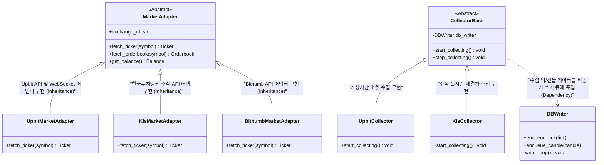
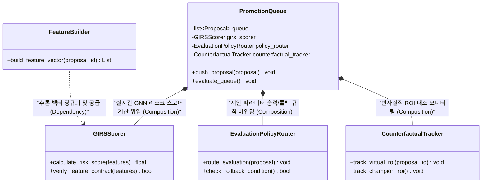

# 클래스 관계도 명세서 (Class Diagram Specification)

이 문서는 통합 실시간 매매 시스템(ATS)의 주요 파이썬 클래스 구조와 객체 지향 설계 관계(상속, 소유, 의존성 등)를 정리한 명세서입니다. 

각 다이어그램은 **Mermaid** 문법으로 작성되어 Mermaid를 지원하는 마크다운 뷰어(예: GitHub, VSCode Mermaid 확장 등)를 통해 시각적으로 조회할 수 있습니다.

---

## 1. 트레이딩 실행 및 전략 레이어 (Core Execution & Strategy)

주문 집행 라이프사이클을 총괄하는 엔진(`TradeEngine`), 모의투자 및 실자산의 계좌/포지션을 관리하는 `PortfolioManager`, 매매 알고리즘 전략이 구동되는 `StrategyHost`와 개별 매매 전략(`BaseStrategy` 구현체) 간의 정합성 구조를 나타냅니다.

```mermaid
classDiagram
    class TradeEngine {
        +start() void
        +stop() void
        -PortfolioManager portfolio_manager
        -StrategyHost strategy_host
        -DatabaseRepository db_repository
    }
    class PortfolioManager {
        +load_portfolio(portfolio_id)
        +update_position(symbol, qty, price)
        +get_balance(exchange_id)
        -DatabaseRepository db_repository
    }
    class StrategyHost {
        +load_strategies()
        +run_loop() void
        -list~BaseStrategy~ strategies
        -PortfolioManager portfolio_manager
    }
    class BaseStrategy {
        <<Abstract>>
        +strategy_id: str
        +on_tick(tick) void
        +on_candle(candle) void
        +generate_order() Order
    }
    class RsiStrategy {
        +rsi_period: int
        +on_candle(candle) void
    }
    class MacdStrategy {
        +on_candle(candle) void
    }
    class TrendBendStrategy {
        +on_candle(candle) void
    }
    class DatabaseRepository {
        +fetch_portfolio(id)
        +save_order(order)
    }

    TradeEngine *-- PortfolioManager : "1 : 1 소유 및 생명주기 관리 (Composition)"
    TradeEngine *-- StrategyHost : "1 : 1 소유 및 실행 루프 바인딩 (Composition)"
    StrategyHost o-- BaseStrategy : "1 : N 전략 인스턴스 참조 및 집합 관리 (Aggregation)"
    BaseStrategy <|-- RsiStrategy : "전략 구현체 확장 (Inheritance)"
    BaseStrategy <|-- MacdStrategy : "전략 구현체 확장 (Inheritance)"
    BaseStrategy <|-- TrendBendStrategy : "전략 구현체 확장 (Inheritance)"
    PortfolioManager ..> DatabaseRepository : "자산 로드 및 체결 기록 영속화 위임 (Dependency)"
    StrategyHost ..> PortfolioManager : "매매 판단 시 현금 및 포지션 한도 검증 위임"
```

### 클래스 역할 정의

* **`TradeEngine` (매매 핵심 엔진)**: 시스템의 심장부로, 포트폴리오 매니저와 전략 호스트를 생성하고 전체 구동 흐름(Start/Stop)을 통제합니다.
* **`PortfolioManager` (자산 포트폴리오 관리자)**: 특정 모의투자 세션 또는 실계좌의 예수금 상태, 개별 보유 자산(수량, 평단가 등)의 무결성을 검증하고 갱신을 제어합니다.
* **`StrategyHost` (전략 실행 호스트)**: 전략 구동 인프라로, 복수의 등록된 매매 전략들을 로드하고 실시간 시세 시그널(Tick/Candle)을 각 전략 인스턴스에 안전하게 분배(Dispatch)합니다.
* **`BaseStrategy` (추상 전략 클래스)**: 모든 자동매매 전략의 인터페이스 가이드라인이 되는 추상 클래스로, 시세 변동 이벤트 발생 시 매수/매도 주문(`Order`)을 최종 판정해 반환하는 형식을 규격화합니다.

---

## 2. 시장 데이터 수집 및 어댑터 레이어 (Market & Collectors)

이종 거래소(Upbit, KIS 등)의 API 요청 및 포맷 차이를 표준 규격화하는 마켓 어댑터(`MarketAdapter`), 소켓 스트리밍 수집 데몬(`CollectorBase`), 그리고 수집된 대량 데이터를 DB에 병목 없이 다중 스레드로 적재하는 `DBWriter` 간의 결합성 구조입니다.



### 클래스 역할 정의

* **`MarketAdapter` (거래소 어댑터 인터페이스)**: 거래소별 상이한 REST/WebSocket 규격을 공통화된 시세 및 주문 DTO 객체(`Ticker`, `Orderbook` 등)로 규격화해 주는 어댑터 패턴 기반 추상 클래스입니다.
* **`CollectorBase` (실시간 수집기 추상화)**: 거래소별 실시간 소켓 연결 및 수집 세션 유지, 재연결 루프를 캡슐화한 상위 클래스입니다.
* **`DBWriter` (비동기 데이터베이스 적재기)**: 수집기와 트레이딩 엔진에서 발생하는 대량 트랜잭션을 메모리 큐에 대기시킨 후, 백그라운드 단일 쓰기 스레드에서 벌크 커밋(`bulk_insert`) 처리하여 SQLite 락 및 디스크 병목을 최소화합니다.

---

## 3. AI 분석 및 리스크 가드 레이어 (AI Analytics & Promotion Queue)

손실 원인 분석을 통한 개선안 도출 후, 실시간 가상 모니터링(`GIRSScorer`), 다중 Horizon 사후 성과 검증(`EvaluationPolicyRouter`), 반사실적 ROI 대조 추적(`CounterfactualTracker`)을 통해 전략 파라미터를 안전하게 승격/격하(Rollback)하는 AI 통제 큐 구조입니다.



### 클래스 역할 정의

* **`PromotionQueue` (승격 FSM 대기열)**: AI 개선 제안 파라미터가 실전 적용되기 전 스코어링(Scored) $\rightarrow$ 순위화(Ranked) $\rightarrow$ 검증(Pending) 단계를 거치는 상태 전이 머신(FSM) 제어를 담당합니다.
* **`GIRSScorer` (GIRS 리스크 판정기)**: 런타임 ONNX 백본 추론 스코어러로, 피처 데이터의 정합성 가드와 섀도 리스크 스코어를 산출하여 안전한 파라미터 판단 근거를 마련합니다.
* **`EvaluationPolicyRouter` (사후 평가 라우터)**: 특정 파라미터 개선안이 실제 혹은 섀도 백테스트 환경에서 목표 수익률(ROI) 및 손실율(MDD) 임계치를 하회하는 경우 가상/실제 롤백을 자동 실행하는 가드 루프입니다.
* **`CounterfactualTracker` (반사실적 추적기)**: 'AI 개선 제안을 적용하지 않고 기존 파라미터를 유지했을 경우'의 수익률(Champion ROI)과 '실제 제안을 적용한 후'의 수익률(Candidate ROI)을 가상으로 실시간 시뮬레이션하여 순수 기여도를 순수 대조 추적합니다.
