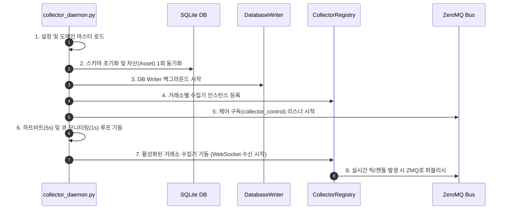
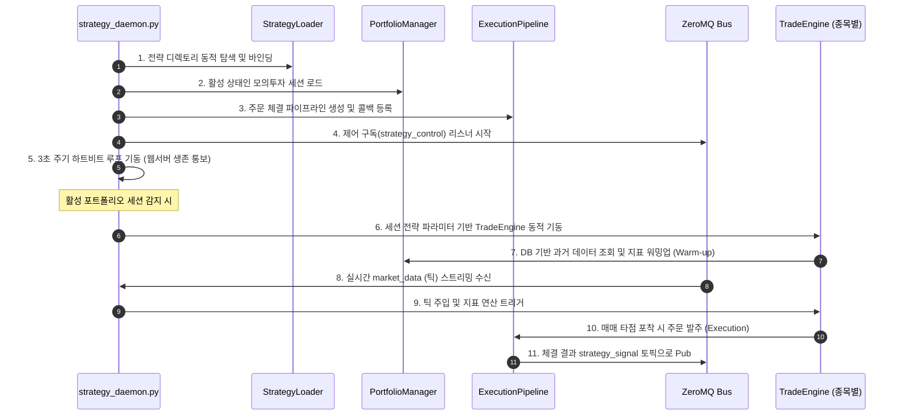

# 데몬 시스템 구성 및 구동 흐름 명세 (Daemon Architecture)

이 문서는 실시간 수집, 트레이딩 시뮬레이션, 제안 사후 평가 및 데이터 관리를 담당하는 네 개의 핵심 데몬 프로세스인 `collector_daemon.py`, `strategy_daemon.py`, `shadow_eval_daemon.py`, `market_cleanup_daemon.py`의 구조, 동작 매커니즘, 라이프사이클 및 프로세스 간 제어 흐름을 명세합니다.

---

## 1. 두 데몬의 역할 분담 개요

시스템의 자원 격리 및 단일 장애점(SPOF) 방지를 위해 수집 프로세스와 전략 연산 프로세스를 분리하여 기동합니다. 이들은 **ZeroMQ IPC 버스**를 통해 데이터를 전달하고 제어 신호를 동적으로 조율합니다.

```
       ┌────────────────────────┐                  ┌────────────────────────┐
       │    Collector Daemon    │                  │    Strategy Daemon     │
       │  (collector_daemon.py) │                  │  (strategy_daemon.py)  │
       └───────────┬────────────┘                  └───────────▲────────────┘
                   │                                           │
                   │  ZMQ IPC: market_data (tick/candle)       │
                   └───────────────────────────────────────────┘
```

---

## 2. 데이터 수집 데몬 (Collector Daemon)

### 2.1. 주요 구성 컴포넌트
- **ConfigManager**: `settings.yaml` 파일 변경을 실시간 감시(Config Watcher)하고 핫리로드합니다.
- **DatabaseWriter**: 큐에 적재된 데이터를 SQLite3 DB에 배치(Batch 50~100) 방식으로 영속화합니다.
- **ZMQ Publishers**: 시세 전송용 `market_data` 및 상태 모니터링용 `signal_data` 퍼블리셔.
- **Publishing Queues (`TickPublishingQueue`, `CandlePublishingQueue`)**: 수집된 개별 틱 및 캔들을 `DatabaseWriter`에 인큐함과 동시에 ZMQ IPC 버스로 실시간 퍼블리시합니다.
- **CollectorRegistry**: 거래소 모듈(Upbit, KIS, Bithumb 등)의 수집 클래스를 동적으로 생성하고 생명주기를 주관합니다.

### 2.2. 구동 시퀀스 및 흐름


### 2.3. 동적 제어 (ZMQ collector_control)
- 웹 서버나 외부에서 ZMQ `collector_control` 토픽으로 `{ "type": "update_symbols", "exchange": "kis", "code": "005930", "is_collected": true }`와 같은 신호를 보낼 시, 수집 데몬은 실시간으로 구독 자산을 해제 또는 추가(`update_subscription`)하며, `StockMapper` 캐시를 리로드합니다.
- 만약 `exchange` 파라미터가 `"all"`인 경우, 구동 중인 모든 수집기에 대해 전체 활성 자산 목록을 DB로부터 새로 읽어와 실시간 핫리로드합니다.

---

## 3. 전략 엔진 데몬 (Strategy Daemon)

### 3.1. 주요 구성 컴포넌트
- **PortfolioManager**: DB로부터 활성(시뮬레이션 중인) 포트폴리오를 로드하고 보유 포지션 및 잔고 자산을 운용합니다.
- **ExecutionPipeline**: 매매 신호(BUY/SELL)가 감지되었을 때, 실제 자산 단가 계산, 수수료 산정 및 DB 상태 기록을 실행하고, 체결 여부를 ZMQ `strategy_signal`로 통지합니다.
- **StrategyRegistry**: 동적으로 전략 디렉토리(`src/engine/strategies`)를 탐색하여 전략 클래스 명세를 파일 시스템에서 동적 로드(`load_dynamic_strategies`)합니다.
- **TradeEngine (종목별)**: 자산 심볼 단위로 독립 생성되어 틱 데이터를 캔들로 병합하고 SMA, RSI 등의 보조지표 연산과 전략 규칙을 매 초마다 판단합니다.

### 3.2. 구동 시퀀스 및 흐름


### 3.3. 세션 핫리로드 (ZMQ strategy_control) 및 동시성 제어
- 사용자가 웹 대시보드에서 특정 모의투자 세션을 시작하거나 종료할 때, 웹서버는 ZMQ `strategy_control` 토픽으로 `{ "type": "update_portfolio" }` 메시지를 전파합니다.
- 이를 감지한 전략 데몬은 기존 종목별 `TradeEngine` 맵을 완전히 클리어한 후, 새롭게 활성화된 포트폴리오 정보에 맞춰 자산군 및 전략 파라미터를 읽어와 TradeEngine을 **실시간으로 재생성하고 초기 웜업 과정을 동적 수행**합니다.
- **원자성 보장**: 실시간 틱 처리 루프(`_market_data_loop`)와 핫리로드(`reload_trade_engines`) 및 파라미터 갱신(`apply_params`)이 충돌하지 않도록 `asyncio.Lock`을 사용해 배타적 실행(Mutual Exclusion)을 보장합니다. 이를 통해 틱 처리 중 핫리로드가 끼어들어 발생하는 딕셔너리 변경 예외 및 틱 유실을 방지합니다.

---

## 4. 데몬 제어 IPC 메시지 프로토콜

프로세스 간 조율을 위해 정의된 ZeroMQ IPC 메시지 전문 형식입니다.

### 4.1. `collector_control` 토픽 (수집기 및 데몬 제어)
- **종목 구독 업데이트**:
```json
{
  "type": "update_symbols",
  "exchange": "kis",
  "code": "005930",
  "is_collected": true
}
```
- **거래소 종목 목록 강제 재동기화 요청 (`request_symbols_sync`)**:
```json
{
  "type": "request_symbols_sync",
  "exchange": "upbit"
}
```
- **데몬 프로세스 자가 재기동 요청 (`restart_daemon`)**:
```json
{
  "type": "restart_daemon",
  "command_id": "cmd-xyz-1234"
}
```

### 4.2. `strategy_control` 토픽 (전략 엔진 제어)
```json
{
  "type": "update_portfolio"
}
```

### 4.3. `collector_signal` 토픽 (수집 데몬 상태 및 메트릭 송출)
- **기본 상태 알림 (`collector_status`)**:
```json
{
  "type": "collector_status",
  "exchange": "upbit",
  "is_running": true,
  "status": "RUNNING",
  "status_reason": null,
  "error": null
}
```
- **큐 상태 전송 (`queue_status`)**:
```json
{
  "type": "queue_status",
  "processing": 12,
  "database": 4,
  "candle": 0,
  "total": 150032
}
```
- **[NEW] 데몬 상태 상세 취합 정보 (`collector_daemon_detail` - 2초 주기)**:
```json
{
  "type": "collector_daemon_detail",
  "queues": {
    "processing": { "qsize": 15, "max_size": 5000, "usage_pct": 0.3, "level": "NORMAL" },
    "database": { "qsize": 5, "max_size": 1000, "usage_pct": 0.5, "level": "NORMAL" },
    "candle": { "qsize": 0, "max_size": 1000, "usage_pct": 0.0, "level": "NORMAL" },
    "total_processed": 152003,
    "total_dropped": 0
  },
  "exchanges": {
    "upbit": {
      "is_running": true,
      "status": "RUNNING",
      "symbols_count": 12,
      "processed_count": 89400,
      "dropped_count": 0,
      "last_tick": { "code": "BTC", "trade_price": 72100000, "trade_timestamp": 1718251234567 },
      "last_error": null
    }
  },
  "memory": {
    "rss_mb": 84.52,
    "stock_mapper_cache_count": 284
  },
  "symbols_version": { "upbit": 1, "bithumb": 1, "kis": 3 },
  "daemon_started_at": 1718250000000,
  "source_pid": 12453
}
```
- **[NEW] 종목 목록 전체 동기화 신호 (`collector_symbols_sync`)**:
```json
{
  "type": "collector_symbols_sync",
  "exchange": "upbit",
  "symbols": ["BTC", "ETH", "XRP"],
  "symbols_version": 1,
  "source_pid": 12453,
  "daemon_started_at": 1718250000000
}
```
- **[NEW] 제어 명령 비동기 처리 응답 (`collector_command_result`)**:
```json
{
  "type": "collector_command_result",
  "command_id": "cmd-xyz-1234",
  "exchange": "upbit",
  "status": "SUCCESS",
  "error": null,
  "timestamp": 1718251240000
}
```

### 4.4. `strategy_signal` 토픽 (전략 데몬 상태 및 체결 송출)
```json
{
  "type": "strategy_status",
  "is_running": true,
  "active_engines": 15,
  "error": null
}
```

---

## 5. Graceful Shutdown (안전 종료 처리)

두 데몬 프로세스는 운영체제 종료 시그널(`SIGINT`, `SIGTERM`, `SIGHUP`) 감지 시 다음과 같은 자원 정리 절차를 순차 진행하여 메모리 누수 및 데이터 정합성 깨짐을 방지합니다.

1. **설정 감시 중단**: Config 파일 감시 및 ZMQ 제어 채널 리스너 태스크를 즉시 취소합니다.
2. **WebSocket 연결 해제**: 구동 중인 수집기 인스턴스의 WebSocket 세션을 안전하게 `close`하고 종료 상태를 방출합니다.
3. **DB 큐 플러시**: `DatabaseWriter`의 데이터 인큐 루프를 종료하고, 내부 큐에 남아 있던 마지막 틱/캔들 데이터를 완전하게 DB 파일에 벌크 커밋 처리한 후 파일 핸들을 닫습니다.
4. **ZMQ 소켓 클로즈**: ZeroMQ 컨텍스트 및 Publisher/Subscriber 소켓을 완전히 닫아 stale 파일 핸들(.ipc 소켓 파일)을 제거합니다.

### 5.1. 공식 시스템 종료 절차
시스템을 안전하게 종료하기 위한 공식 명령은 다음과 같습니다:
```bash
./run.sh stop
```
이 명령은 tmux 세션 내 모든 프로세스에 종료 시그널(Ctrl+C / SIGINT)을 순차적으로 전달하여 위의 정리 절차가 정상 완수되도록 유도합니다. 그 후 모든 파이썬 백그라운드 프로세스가 안정적으로 꺼졌는지 검사한 뒤 최종적으로 남은 tmux 세션 껍데기를 정리합니다.

> [!WARNING]
> **`tmux kill-session -t ats` 단독 실행 비권장**
> 이 명령을 단독으로 즉시 수행하면 프로세스들이 자원을 정리할 틈 없이 급사하게 되어 DB 데이터 정합성 깨짐, 메모리/소켓 찌꺼기 파일 잔존 등의 문제를 유발할 수 있으므로, 비상 상황이 아닌 한 **절대 단독으로 사용하지 않는 것을 권장**합니다. 항상 `./run.sh stop`을 사용해 안전 종료를 유도하세요.

---

## 6. 성능 최적화를 위한 메모리 캐싱 및 버퍼링 정책 (Core Memory Caching & Buffering Policy)

실시간 고빈도 체결 시세와 지표 계산은 디스크 I/O와 메모리 할당 병목을 최소화하기 위해 강력한 메모리 버퍼 및 캐시 정책을 사용합니다.

### 6.1. 데이터 수집 데몬 (Collector Daemon)의 캐싱 및 버퍼링
- **매핑 사전 메모리 캐싱 (`StockMapper`)**: 
  - [stock_mapper.py](file:///home/simon/ATS/src/engine/utils/stock_mapper.py)
  - 기동 시 데이터베이스 `asset_master` 테이블 전체를 단 1회 로드하여 메모리 사전(`self._mapping`)에 캐시합니다. 
  - 매 틱(Tick) 수신 시 한글명 매핑을 위한 디스크/API 호출 없이 O(1) 복잡도의 메모리 캐시 룩업을 수행합니다.
- **SQLite3 벌크 쓰기 버퍼링 (`DatabaseWriter`)**:
  - [writer.py](file:///home/simon/ATS/src/database/writer.py)
  - 틱 데이터를 발생할 때마다 개별 디스크에 쓰지 않고, 메모리 큐(`db_queue`)에 우선 적재 및 임시 보관(버퍼링)합니다.
  - 50건 또는 100건 단위로 큐의 패킷이 누적되거나 시간 초과(1초)가 발생하면, 메모리 버퍼의 데이터를 `executemany()` 메서드를 사용해 단일 SQLite3 트랜잭션으로 한 번에 영속화(Commit)합니다. 이는 디스크 쓰기 병목과 DB 락을 원천 예방합니다.

### 6.2. 전략 엔진 데몬 (Strategy Daemon)의 캐싱 및 롤링 버퍼
- **캔들 롤링 캐시 버퍼 (`StrategyHost`)**:
  - [strategy_host.py](file:///home/simon/ATS/src/engine/strategy_host.py)
  - 실시간 전략 검증을 위해 매번 과거 데이터베이스에서 캔들 이력을 쿼리하지 않습니다. 
  - 데몬 가동(Warm-up) 시점에만 DB에서 종목별 과거 캔들을 1회 조회해 메모리 덱(List) 구조인 `self.candles`에 로딩(캐시)합니다.
  - 런타임에는 새로 유입되어 마감된 실시간 캔들만 `self.candles.append()`를 통해 메모리 상에 추가하며, 메모리 과부하를 방지하기 위해 최대 200개만 유지하고 이전 데이터는 즉각 메모리에서 제거(`len(self.candles) > 200: pop(0)`) 관리합니다.
- **보조지표 증분 계산 기법 (`IndicatorCalculator`)**:
  - [indicators.py](file:///home/simon/ATS/src/engine/indicators.py)
  - 캔들이 갱신될 때마다 전체 데이터셋을 pandas DataFrame 등으로 파싱하여 루프 연산하는 방식(O(N))을 사용하지 않습니다.
  - 최근 유입된 단일 가격만 갱신하여 점진적 보정으로 지표값(SMA, RSI, Bollinger Bands)을 산출해내는 증분 계산(Incremental Calculation) 알고리즘을 사용합니다. 이를 통해 O(1) 수준의 연산 속도를 보장하여 CPU 연산 부하를 최소화합니다.

---

## 7. 실시간 예외 상황 처리 및 자격 복구 정책 (Edge Case & Error Recovery Policies)

실시간 데이터 스트리밍 환경에서 빈번히 마주하는 시장 외 시간 및 거래소 특이 종목에 대한 시스템 예외 처리 및 복구 정책입니다.

### 7.1. 국내 주식 장마감(소켓 차단) 시 시세 복구 정책 (KIS 웜업)
국내 주식(KIS) 장마감(오후 6시 10분 이후) 시점에는 실시간 WebSocket 서버가 닫혀 틱 데이터 전송이 완전히 차단됩니다. 이 상황에서 웹 서버나 전략 엔진이 재기동되는 경우 메모리 캐시 소멸로 마켓 대시보드가 텅 비는 오류를 복구하기 위해 다음 정책을 수행합니다.
- **동적 DB 역산 복구**: KIS 어댑터([kis.py](file:///home/simon/ATS/src/engine/market/kis.py))는 메모리 시세 캐시에 가격이 0으로 잡힐 시 `SqliteMarketDataRepository.warm_up_kis_cache(symbol)`를 호출합니다.
- **복구 순서**:
  1. `trades` 테이블에서 해당 종목의 마지막 기록된 틱 체결가를 로드합니다.
  2. `candles`(1분봉) 테이블에서 당일 최고가, 최저가, 누적 거래량을 로드합니다.
  3. 전일 자 동시간대 종가 캔들을 조회하여 현재 복구된 체결가와 대조한 뒤, 24시간 주가 등락률(`signed_change_rate`)을 역산하여 메모리 시세 캐시(`latest_prices`)에 강제 적재합니다.
- 이를 통해 소켓이 차단된 비영업 시간에도 대시보드 화면에 최종 마감 단가와 등락률이 정상 노출되도록 보장합니다.

### 7.2. 거래 미발생 및 정지/신규 대기 종목의 예외 처리
자산 동기화 과정을 거쳐 거래소 목록상에는 존재하지만 실제 거래(체결)가 발생하지 않는 종목(예: 빗썸 `BILL` 코인, 거래정지 주식 등)이 활성화될 경우에 대한 예외 방침입니다.
- **현상**: 거래소 Websocket 구독 목록에 등록되어 요청되더라도 실제 체결 틱이 방출되지 않으므로 DB에 틱과 캔들이 누적되지 않으며, Ticker API 질의 시에도 가격 및 타임스탬프가 `None` 또는 `0`으로 반환됩니다.
- **시스템 정책**:
  - `BaseCollector`는 해당 종목을 구독 목록(`available_symbols`)에는 올리지만, 데이터가 유입되지 않을 때 임의로 더미 가격을 생성하지 않고 실제 체결 틱이 최초 유입될 때까지 영속화 처리를 대기합니다.
  - 프론트엔드 UI는 최신 캐시의 가격 정보가 `None` 또는 `0`일 경우, 차트 영역에 '준비중(Waiting for Data)' 상태를 출력하거나 차트 렌더링을 보류하여 비정상적인 지표 연산(나누기 0 오류 등)으로 인한 스크립트 크래시를 미연에 방지합니다.

---

## 8. 제안 사후 평가 데몬 (Shadow Evaluation Daemon)

`shadow_eval_daemon.py`는 GIRS Shadow Operation의 다중 Horizon 평가 FSM을 비동기로 안전하게 완결시키는 데몬 프로세스입니다.

- **기동 메커니즘**: `DaemonSupervisor`를 상속하여 독립적으로 기동하며, 락 경합 방지용 원자적 분산 선점 기법을 통해 다중 워커 환경에서도 평가의 중복 처리를 완벽히 방어합니다.
- **동작 루프**:
  1. **평가 대상 선제적 웜업 및 Baseline 스냅샷 캡처 (`_capture_baselines`)**:
     - `PENDING` 상태의 평가 항목 중, 평가 개시 시점(`due_at - horizon_value <= now`)에 진입한 대상에 대해 당시의 시작 캔들 종가(`baseline_value`)를 획득하여 선제적으로 데이터베이스에 백업 스냅샷을 구성합니다.
     - 이를 통해 향후 TTL 정책에 의해 과거 틱/단기 분봉 데이터가 정리(Purge)되더라도, 평가 마기 시점에 시작 가격의 소실 없이 평가를 성공적으로 완수할 수 있는 이중 보호 장치를 달성합니다.
  2. **만기 평가 마감 처리 루틴 (`_evaluation_loop`)**:
     - 10초 주기로 만기 시각(`due_at`)을 지난 `PENDING` 상태의 평가들을 조회합니다.
     - 원자적 UPDATE(`claim_evaluation`) 쿼리를 실행해 먼저 락을 획득(선점)한 워커만 실제 가격 및 거래량 산출 연산을 수행합니다.
     - 앞서 저장된 `baseline_value`(없을 시 `candles` 조회 fallback)와 현재 마기 종가 간의 가격 변화율을 구하여 실측 ROI를 산출하고, `COMPLETED`로 상태를 마감합니다.
  3. **Stale Lock 복구 루틴 (`_stale_lock_recovery_loop`)**:
     - 60초 주기로 `EVALUATING` 상태로 오랜 시간(300초 초과) 머물러 락이 고정된 stale 레코드를 감지합니다.
     - 재시도 횟수 내에서는 `PENDING` 상태로 원복하여 재시도하게 하며, 재시도 한도를 초과하면 `ERROR` 상태로 최종 복구 격리 처리합니다.
   4. **수동 재평가 Job Queue 처리 루프 (`_manual_reeval_loop`) [NEW]**:
      - 10초 주기로 `proposal_reevaluation_jobs` 테이블에서 `QUEUED` 상태의 수동 재평가 Job을 감지합니다.
      - 원자적 UPDATE로 Job을 선점(`RUNNING`)한 후 `_execute_reevaluation()`를 호출합니다.
      - **`_execute_reevaluation()` 내부 처리 흐름**:
        1. `promotion_event_log`에서 제안의 FeatureSnapshot을 조회합니다. 데이터가 없으면 합성 기본값 Snapshot으로 폴백합니다(Shadow 전용, 실거래 미사용 안전).
        2. `GIRSScorer`로 GIRS 리스크·안정성·최종 승격 점수를 재추론합니다.
        3. `BacktestEngine`으로 Counterfactual Simulation을 시도하며, 틱 데이터 부족 등으로 실패 시 결과를 `None`으로 처리하고 GIRS 점수만으로 완료합니다.
        4. 결과를 `proposal_evaluation_runs` 테이블에 Append-only로 저장하고 `system_events`에 감사 로그를 기록합니다.
      - **Side Effect 완벽 차단**: `allow_live_order=False`, `allow_promotion_apply=False`로 실거래·자동 승격이 절대 발생하지 않습니다.

---

## 9. 시장 데이터 관리 데몬 (Market Data Cleanup Daemon)

`market_cleanup_daemon.py`는 데이터베이스의 누적 디스크 용량을 제어하고 런타임 성능을 유지하는 데몬 프로세스입니다.

- **주요 기능**:
  1. **틱 데이터 청소 (`clean_old_trades`)**:
     - 72시간(3일)을 초과한 오래된 `trades` 데이터를 청소합니다.
     - 한 번에 대량의 행을 `DELETE`할 시 발생하는 SQLite 데이터베이스의 Exclusive Lock 독점을 막기 위해, 최대 50,000건씩 분할 청크로 삭제하며 삭제 주기 사이에 `asyncio.sleep(0.1)`의 CPU 양보 시간을 갖습니다.
  2. **오래된 캔들 다운샘플링 (`_downsample_old_candles`)**:
     - 30일을 초과한 1분봉 등의 세밀한 단기 분봉 `candles` 데이터를 지우기 전에, 1시간봉(`interval = 3600`) 단위로 다운샘플링 취합을 수행하여 영구적인 aggregate 분석용으로 합산 보존합니다.
     - 다운샘플링 시에는 그룹 내 최초의 시가(open), 최후의 종가(close), 기간 내 최고가(high) 및 최저가(low)와 총 누적 거래량(volume)을 정확히 산출하여 덮어씁니다.
  3. **단기 분봉 청소 (`clean_old_candles`)**:
     - 30일을 초과한 데이터 중 `interval < 3600`(1분봉 등)에 해당하는 세밀한 캔들 데이터만을 50,000건 청크 단위로 안전하게 삭제합니다. 1시간봉 이상의 상위 주기는 그대로 보존되어 장기 시세 분석에 사용됩니다.
- **안전 가드 (Safety Guard)**:
  - 아직 평가되지 않은 `PENDING` 상태의 제안들의 평가 데이터(틱 및 캔들)가 지워지는 것을 방지하기 위해, 데이터 정리의 임계 시각을 계산할 때 현재 활성 `PENDING` 제안 중 가장 과거의 시점(`due_at - horizon_value` 최소치)을 계산하여 삭제 임계 시각이 이를 절대 초과할 수 없도록 자동 보정 및 보호합니다.
  - 정리 작업이 한 루프 돌 때마다 `system_events`에 `MARKET_DATA_CLEANUP_SUMMARY` 요약 감사 로그를 JSON 형식으로 1건 적재하여 용량 관리 현황을 투명하게 보고합니다.

---

## 10. 단일 설정 파일 명세 (Configuration Specification)

시스템은 `config/settings.yaml` 파일 하나를 단일 진실 공급원(SSOT)으로 삼아 동작합니다.

### 10.1. 주요 정책 및 안전 조건
- **[settings.yaml](file:///home/simon/ATS/config/settings.yaml)**:
  - 다중 Horizon 사후 평가의 실제 운영 환경 스펙인 **1d/3d/7d Horizon**을 기본적으로 구성합니다.
  - **주의 및 안전 조건**: `operation_mode = shadow`, `live_trading_enabled = false` 및 `auto_strategy_promotion_enabled = false`는 항상 `false`로 유지됩니다.
- **Fail-Fast 정책**: 
  - 과거에 사용하던 설정 프로필(`settings_production.yaml`, `settings_rehearsal.yaml`)을 환경변수 `ATS_CONFIG` 또는 기동 인자로 로드하려 시도할 경우, 시스템은 조용히 대체하지 않고 즉시 `ValueError` 예외를 발생시켜 프로세스를 기동 중단(Fail-Fast)시킵니다.

### 10.2. 기동 및 제어 흐름
- 모든 데몬(`collector_daemon.py`, `strategy_daemon.py`, `shadow_eval_daemon.py`, `market_cleanup_daemon.py`) 및 헬퍼 유틸들은 실행 시 시스템 환경변수 `ATS_CONFIG`를 동적으로 참조하며, 기본값은 `config/settings.yaml`입니다.
- **`run.sh` 공식 스크립트 제어**:
  - **기동 (`./run.sh start` 또는 `./run.sh`)**: `ats` tmux 세션을 생성하여 5개 데몬을 기동시킵니다. 중복 기동 시도 시 에러를 뿜으며 즉시 종료됩니다.
  - **종료 (`./run.sh stop`)**: 세션 내의 모든 데몬들에게 SIGINT(Ctrl+C) 신호를 보내 안전한 Graceful Shutdown이 유도되도록 정리 후 최종적으로 tmux 세션을 정리합니다.
  - **재시작 (`./run.sh restart`)**: 안전 종료(`stop`) 프로세스를 먼저 끝낸 뒤, 재기동(`start`)을 시작합니다.
  - 옵션으로 웹 서버 핫 리로딩을 켜고 싶을 경우 `start`나 `restart` 커맨드 뒤에 `--reload`를 덧붙여 실행합니다 (예: `./run.sh start --reload`).

---

## 11. 로깅 및 모니터링 가시성 정책 (Logging & Telemetry Policy)

실시간 트레이딩 환경의 디버깅 가시성을 확보하고 로그 중복으로 인한 가독성 저하를 방지하기 위해 다음과 같은 로깅 정책을 강제합니다.

### 11.1. 로거 네임스페이스 자동 정규화
- `get_logger(name)`을 통해 로거를 획득할 때, 모듈 로거 이름이 `src.` 접두사로 시작하지 않는 경우(예: `strategy_service`) 자동으로 `src.` 접두사(예: `src.strategy_service`)를 부여합니다.
- 이를 통해 개별 서비스의 로그가 최상위 `src` 로거로 유실 없이 버블링(Bubble-up)되어 전파(propagation)되도록 보장하며, 최종적으로 `logs/ats.log` 및 콘솔 콘솔 핸들러에 적절히 보존됩니다.

### 11.2. 로깅 핸들러 중복 등록 방어
- 데몬 재시작 또는 설정 핫리로드 시 `setup_logging`이 여러 모듈에 의해 다중 호출되어 핸들러가 중복 등록되고 동일 로그가 콘솔 및 파일에 여러 번 인쇄되는 현상을 방지합니다.
- `setup_logging` 실행 시 `logging.getLogger('src')`에 이미 바인딩된 핸들러(`target_logger.handlers`)가 존재할 경우, 전역 상태 변수(`_is_initialized`)를 즉시 True로 복원하고 초기화 단계를 회피합니다.

### 11.3. 실시간 틱 가드 및 미매칭 키 경고 Throttling
- 실시간 틱 수신 루프(`_market_data_loop`) 내부로 들어오는 틱 중 `exchange_id` 및 `symbol`이 결여된 불량 이벤트 감지 시 즉각 `warning` 로그를 남기고 폐기하여 데이터 무결성을 보장합니다.
- 활성화된 TradeEngine 세션에 등록되지 않은 종목의 틱(`exchange_id:symbol` 미매칭 키)이 들어올 경우, 실시간 고속 스트리밍 환경에서 콘솔 로그가 폭발하는 것을 막기 위해 `self._unmatched_keys` 집합을 사용하여 **최초 1회만 경고 로그**를 발생시키고 이후에는 경고를 음소거(Throttling)합니다.


