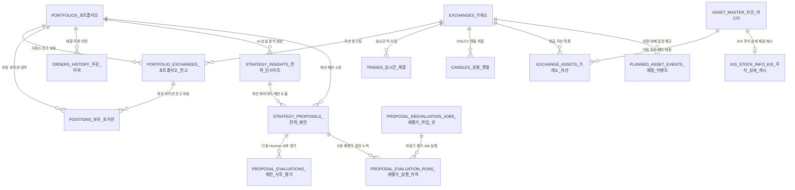
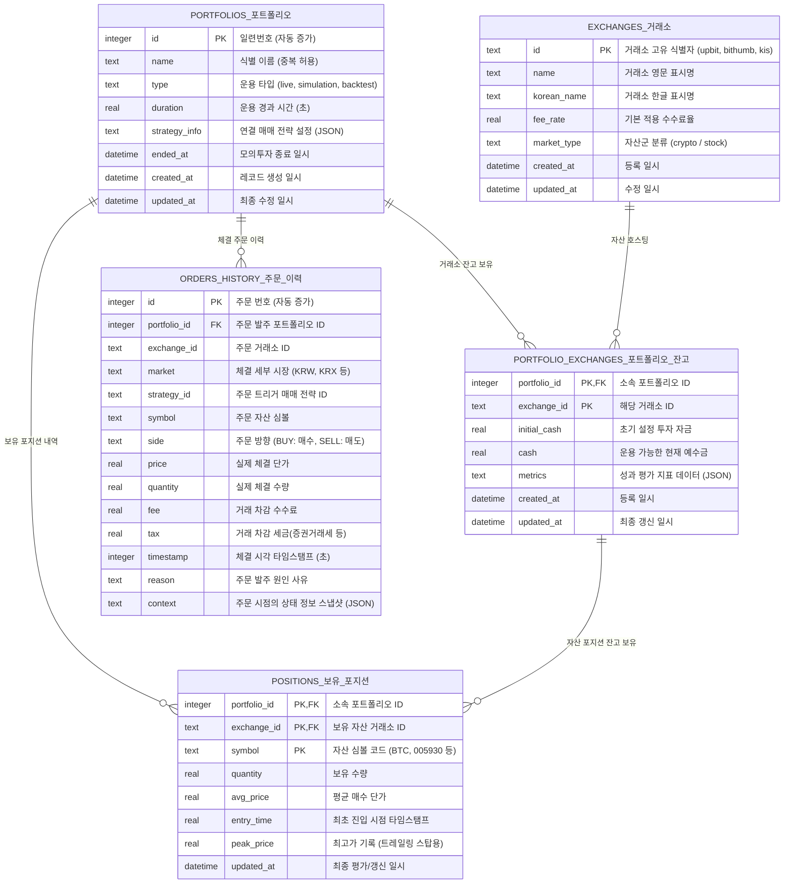
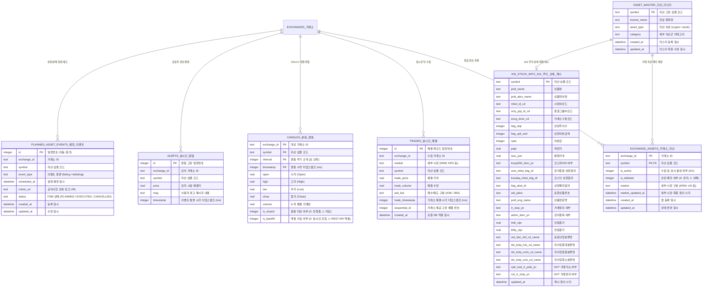
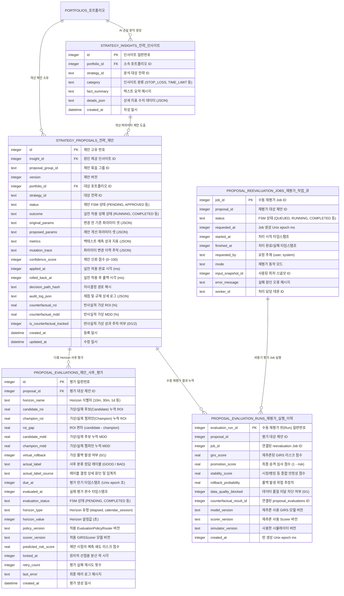
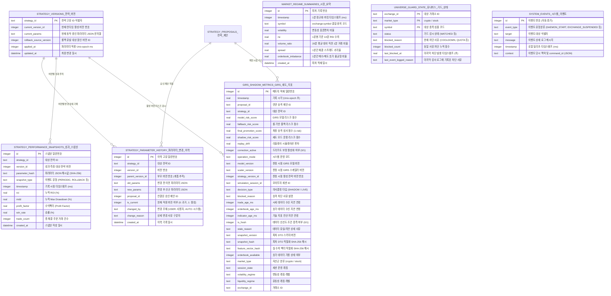

# 데이터베이스 상세 명세 (Database Specification)

> [!IMPORTANT]
> **스키마 변경 시 주의사항 (Developer & AI Agent Rules)**
> * 본 문서에는 데이터베이스 스키마 정보가 **시각적 ERD(Mermaid 다이어그램)**와 **텍스트 테이블(컬럼 상세 명세)** 양쪽 형태로 중복 기술되어 있습니다.
> * 테이블 스키마, 컬럼 추가/제거 등의 변경 작업을 수행할 때는 **반드시 다이어그램 영역과 테이블 상세 기술 영역 두 곳을 모두 함께 수정**하여 싱크를 일치시켜야 합니다.

이 문서는 통합 실시간 매매 시스템(ATS)의 SQLite 데이터베이스 스키마, 테이블 제약조건, 관계성 및 성능 향상을 위한 인덱스 구조를 정의합니다. 또한 시스템의 테이블 간 Entity-Relationship Diagram(ERD)과 도메인 영역별 세부 관계 및 데이터 형식을 다룹니다.

- **데이터베이스 파일 위치**: `data/backtest.db`
- **구현 관리 파일**: [schema.py](file:///home/simon/ATS/src/database/schema.py)

---

## 1. 개략적 관계도 (High-Level Entity Relationship Diagram)

시스템의 테이블 간 관계를 거시적으로 나타낸 다이어그램입니다. 포트폴리오를 중심으로 주문/포지션이 묶이고, 거래소 정보와 자산 마스터 정보가 수집용 데이터(`trades`, `candles`, `exchange_assets`)와 연동됩니다.

이 문서의 다이어그램은 **Mermaid** 문법으로 작성되었습니다. Mermaid를 지원하는 마크다운 뷰어(예: GitHub, VSCode Mermaid 확장 등)를 통해 시각적으로 조회할 수 있습니다.

### 개략적 관계도 내 주요 테이블 한글 설명 및 역할 요약

| 테이블 물리명 | 한글 논리명 | 역할 및 주요 설명 |
| :--- | :--- | :--- |
| `PORTFOLIOS` | 포트폴리오 마스터 | 백테스트 및 실시간 거래 시뮬레이션의 운용 계정 정보 |
| `EXCHANGES` | 거래소 마스터 | 지원 거래소(Upbit, Bithumb, KIS)의 수수료율 및 자산군 메타데이터 |
| `PORTFOLIO_EXCHANGES` | 포트폴리오 잔고 | 포트폴리오별 소속 거래소의 투자 자금, 예수금, 성과 메트릭 정보 |
| `POSITIONS` | 보유 포지션 | 포트폴리오가 현재 보유 중인 개별 자산의 수량, 평균 매수 단가 등 정보 |
| `ORDERS_HISTORY` | 주문 체결 이력 | 거래 집행 과정에서 발생한 모든 매수/매도 주문의 체결 단가, 수량, 수수료, 사유 |
| `ASSET_MASTER` | 자산 정보 마스터 | 전 시장/거래소의 자산 한글명 및 기본 메타데이터 캐시 |
| `EXCHANGE_ASSETS` | 거래소 자산 관리 | 각 거래소에서 실시간 수집 및 매매 감시를 진행할 활성 종목 및 상폐 상태 제어 |
| `TRADES` | 실시간 체결 (Tick) | 거래소 소켓 등으로부터 실시간 수집된 틱 데이터 적재 |
| `CANDLES` | 분봉 캔들 (OHLCV) | 틱 데이터를 특정 주기(초 단위)로 가공한 역사적 캔들스틱 데이터 |
| `ALERTS` | 실시간 알림 | 가격 급등락이나 기술 지표 특정 조건 돌파 시 발생하는 시스템 Alert 메시지 |
| `STRATEGY_INSIGHTS` | 전략 통계 인사이트 | AI 손실 원인 분석을 통해 도출한 통계적 진단 결과 |
| `STRATEGY_PROPOSALS` | 전략 개선 제안 | AI 분석을 바탕으로 파라미터 개선을 제안하고 그 승인/적용 상태 관리 |
| `PROPOSAL_EVALUATIONS` | 제안 사후 평가 | 적용된 제안에 대해 다중 시간축(Horizon) 기준으로 롤백 여부 사후 검증 |
| `PROPOSAL_REEVALUATION_JOBS` | 재평가 작업 큐 | 비동기로 동작하는 사용자의 수동 재평가 요청 작업 대기열 |
| `PROPOSAL_EVALUATION_RUNS` | 재평가 실행 이력 | 수동 재평가 작업 완료에 따라 계산된 리스크 및 승격 심사 점수 이력 |
| `STRATEGY_VERSIONS` | 전략 활성 버전 | 각 매매 전략별 현재 활성화된 파라미터 버전 정보 |
| `STRATEGY_PARAMETER_HISTORY` | 파라미터 변경 이력 | 파라미터 변경(수동 수정, AI 자동 적용, 롤백 등)에 대한 이력 및 계보 추적 |
| `STRATEGY_PERFORMANCE_SNAPSHOTS` | 전략 성과 스냅샷 | 특정 이벤트 발생 시점 기준의 누적 ROI, MDD, 승률 등의 지표 기록 |
| `MARKET_REGIME_SUMMARIES` | 시장 상태 요약 | 1분 단위로 수집된 시장 변동성, RSI, 호가 불균형 등 분석용 피처 데이터 |
| `GIRS_SHADOW_METRICS` | GIRS 섀도 지표 | 실시간 섀도 모니터링 시점의 모델 리스크 점수, 데이터 신선도, 연산 지연 상태 |
| `UNIVERSE_GUARD_STATE` | 유니버스 가드 상태 | 쿨다운/한도 제한 등으로 실시간 매매 대상에서 일시 차단된 종목 감시 상태 |
| `KIS_STOCK_INFO` | KIS 주식 상세 캐시 | KIS OpenAPI에서 조회한 종목별 세부 제원(Nextrade 연동 여부 포함) 캐시 |
| `SYSTEM_EVENTS` | 시스템 이벤트 | 데몬 기동/종료, 에러, 사용자 수동 제어 등 시스템 운영 이력 및 감사 로그 |
| `PLANNED_ASSET_EVENTS` | 상장/상폐 예정 이벤트 | 신규 상장이나 상장폐지가 예정된 자산의 스케줄 일정 및 FSM 처리 상태 관리 |



---

## 2. 테이블 정의 (Table Definitions)

### 2.1. 사용자 및 자산 코어 영역
사용자의 투자 계정(포트폴리오), 연결 거래소 잔고, 보유 중인 자산 포지션 및 거래 집행 이력을 관리하는 핵심 영역입니다.



#### 2.1.1. portfolios (시뮬레이션 포트폴리오 마스터)
백테스트 및 실시간 거래 시뮬레이션 과정에서 운용되는 포트폴리오의 마스터 정보를 관리합니다.

| 컬럼명 | 데이터 타입 | 제약조건 / 기본값 | 설명 |
| :--- | :--- | :--- | :--- |
| **id** (PK) | INTEGER | PRIMARY KEY AUTOINCREMENT | 포트폴리오 고유 ID (정수) |
| **name** | TEXT | NOT NULL | 포트폴리오 식별 이름 |
| **type** | TEXT | NOT NULL CHECK (type IN ('live', 'simulation', 'backtest')) | 운용 타입 (`live`, `simulation`, `backtest`) |
| **duration** | REAL | DEFAULT 0.0 | 백테스트 소요 시간 등 운용 경과 시간 (초) |
| **strategy_info** | TEXT | DEFAULT '' | 연결된 매매 전략 설정 정보 (JSON 스트링 등) |
| **ended_at** | DATETIME | - | 포트폴리오(모의투자) 종료 일시 (진행 중인 경우 NULL) |
| **created_at** | DATETIME | DEFAULT CURRENT_TIMESTAMP | 생성 일시 |
| **updated_at** | DATETIME | DEFAULT CURRENT_TIMESTAMP | 최종 갱신 일시 |

#### 2.1.2. exchanges (거래소 마스터)
시스템 내부에서 처리하는 시장/거래소 정보를 저장합니다.

| 컬럼명 | 데이터 타입 | 제약조건 / 기본값 | 설명 |
| :--- | :--- | :--- | :--- |
| **id** (PK) | TEXT | NOT NULL | 거래소 고유 식별자 (`upbit`, `bithumb`, `kis`) |
| **name** | TEXT | NOT NULL | 거래소 영문 표시명 (`Upbit`, `Bithumb`, `KIS`) |
| **korean_name** | TEXT | - | 거래소 한글 표시명 (`업비트`, `빗썸`, `한국투자증권`) |
| **fee_rate** | REAL | DEFAULT 0.0005 | 거래소 수수료율 |
| **market_type** | TEXT | DEFAULT 'crypto' | 자산군 분류 (`crypto`, `stock`) |
| **created_at** | DATETIME | DEFAULT CURRENT_TIMESTAMP | 레코드 생성 일시 |
| **updated_at** | DATETIME | DEFAULT CURRENT_TIMESTAMP | 레코드 최종 변경 일시 |

#### 2.1.3. portfolio_exchanges (포트폴리오-거래소 맵 및 세부 잔고)
하나의 포트폴리오가 복수의 거래소 자산을 동시에 보유/관리할 수 있도록 보장하는 중간 맵 테이블입니다.

| 컬럼명 | 데이터 타입 | 제약조건 / 기본값 | 설명 |
| :--- | :--- | :--- | :--- |
| **portfolio_id** (PK, FK) | INTEGER | REFERENCES portfolios(id) ON UPDATE CASCADE ON DELETE CASCADE | 소속 포트폴리오 ID |
| **exchange_id** (PK) | TEXT | - | 해당 자산이 귀속된 거래소 ID |
| **initial_cash** | REAL | DEFAULT 0.0 | 해당 거래소용 초기 설정 현금 |
| **cash** | REAL | DEFAULT 0.0 | 해당 거래소에서 운용 가능한 현재 현금 |
| **metrics** | TEXT | DEFAULT '{}' | 포트폴리오 성과 지표 (MDD, 승률, 누적수익률 등 JSON 포맷) |
| **created_at** | DATETIME | DEFAULT CURRENT_TIMESTAMP | 생성 일시 |
| **updated_at** | DATETIME | DEFAULT CURRENT_TIMESTAMP | 최종 변경 일시 |

#### 2.1.4. positions (보유 자산 포지션)
포트폴리오가 현재 실시간/가상으로 보유 중인 자산 목록을 상세 기록합니다. (국내 주식의 경우 KRX와 NXT의 세부 구분 없이 단일 `symbol` 하에 통합 합산되어 잔고가 관리됩니다.)

| 컬럼명 | 데이터 타입 | 제약조건 / 기본값 | 설명 |
| :--- | :--- | :--- | :--- |
| **portfolio_id** (PK, FK) | INTEGER | - | 소속 포트폴리오 ID |
| **exchange_id** (PK, FK) | TEXT | - | 보유 자산의 거래소 ID |
| **symbol** (PK) | TEXT | - | 자산 심볼 |
| **quantity** | REAL | DEFAULT 0 | 보유 수량 (실시간 매매 시 소수점 지원) |
| **avg_price** | REAL | DEFAULT 0 | 평균 매수 단가 |
| **entry_time** | REAL | DEFAULT 0.0 | 포지션 최초 진입 시각 (Unix Epoch, 초) |
| **peak_price** | REAL | DEFAULT 0.0 | 포지션 진입 후 도달한 최고 가격 (트레일링 스탑용) |
| **updated_at** | DATETIME | DEFAULT CURRENT_TIMESTAMP | 최종 갱신 일시 |

#### 2.1.5. orders_history (주문 내역 이력)
시뮬레이션 및 실제 매매 집행 과정에서 발생한 모든 주문 내역을 상세 저장합니다.

| 컬럼명 | 데이터 타입 | 제약조건 / 기본값 | 설명 |
| :--- | :--- | :--- | :--- |
| **id** (PK) | INTEGER | PRIMARY KEY AUTOINCREMENT | 주문 번호 (자동 증가) |
| **portfolio_id** (FK) | INTEGER | REFERENCES portfolios(id) ON UPDATE CASCADE ON DELETE CASCADE | 발주한 포트폴리오 ID |
| **exchange_id** | TEXT | - | 주문 거래소 ID |
| **market** | TEXT | - | 주문 및 실제 체결된 세부 시장 (예: `KRW` / `KRX`, `NXT`, `SOR`) |
| **strategy_id** | TEXT | - | 발주를 유도한 매매 전략 ID |
| **symbol** | TEXT | - | 주문 대상 자산 심볼 |
| **side** | TEXT | - | 주문 구분 (`BUY`: 매수, `SELL`: 매도) |
| **price** | REAL | - | 주문 체결 단가 |
| **quantity** | REAL | - | 주문 체결 수량 |
| **fee** | REAL | - | 주문 시 차감된 수수료 |
| **tax** | REAL | 0.0 | 주문 시 차감된 세금 (증권거래세 등) |
| **timestamp** | INTEGER | - | 체결 시점 타임스탬프 (Unix Time) |
| **reason** | TEXT | - | 주문 트리거 사유 (예: `RSI Under 30`) |
| **context** | TEXT | - | 주문 당시의 상태 맥락 스냅샷 (JSON 스트링) |

---

### 2.2. 시장 시세 및 수집 영역
실시간으로 거래소로부터 수집되는 틱 데이터와 가변 시간 프레임으로 가공되는 캔들 정보, 거래소별 감시 활성 대상 자산군을 제어합니다.



#### 2.2.1. asset_master (전체 자산 정보 마스터)
전체 거래 대상 자산의 메타데이터와 국가별 한글명을 일괄 캐시/관리합니다.

| 컬럼명 | 데이터 타입 | 제약조건 / 기본값 | 설명 |
| :--- | :--- | :--- | :--- |
| **symbol** (PK) | TEXT | NOT NULL | 자산 심볼 (예: `BTC`, `005930`) |
| **korean_name** | TEXT | NOT NULL | 한글 종목명 (예: `비트코인`, `삼성전자`) |
| **asset_type** | TEXT | NOT NULL | 자산 속성 구분 (`crypto`, `stock`) |
| **category** | TEXT | - | 세부 자산군 카테고리 (`ETF`, `ETN`, `ELW`, `Crypto`, `KOSPI`, `KOSDAQ` 등) |
| **created_at** | DATETIME | DEFAULT CURRENT_TIMESTAMP | 생성 일시 |
| **updated_at** | DATETIME | DEFAULT CURRENT_TIMESTAMP | 최종 변경 일시 |

#### 2.2.2. exchange_assets (거래소별 취급 자산 관리)
각 거래소에서 실제 거래 가능하거나, 시스템에서 실시간으로 수집/트레이딩할 활성 자산 상태를 연결합니다.

| 컬럼명 | 데이터 타입 | 제약조건 / 기본값 | 설명 |
| :--- | :--- | :--- | :--- |
| **exchange_id** (PK) | TEXT | - | 거래소 ID |
| **symbol** (PK, FK) | TEXT | REFERENCES asset_master(symbol) ON UPDATE CASCADE | 자산 심볼 |
| **is_active** | INTEGER | DEFAULT 1 | 현재 수집 및 전략 감시 활성화 여부 (0: 비활성, 1: 활성) |
| **is_delisted** | INTEGER | DEFAULT 0 | 상장 폐지 여부 (1: 상장폐지) |
| **market** | TEXT | - | 실시간 구독 대상 세부 시장 구분 (예: `KRW`, `UN` 등) |
| **market_updated_at** | DATETIME | - | 세부 시장 구분 최종 확인 및 업데이트 시각 |
| **created_at** | DATETIME | DEFAULT CURRENT_TIMESTAMP | 등록 일시 |
| **updated_at** | DATETIME | DEFAULT CURRENT_TIMESTAMP | 상태 갱신 일시 |

#### 2.2.3. trades (실시간 틱 데이터)
거래소로부터 실시간 수신한 개별 체결(Tick) 내역을 기록합니다.

| 컬럼명 | 데이터 타입 | 제약조건 / 기본값 | 설명 |
| :--- | :--- | :--- | :--- |
| **id** (PK) | INTEGER | PRIMARY KEY AUTOINCREMENT | 체결 레코드 순번 |
| **exchange_id** | TEXT | - | 거래소 ID (`upbit`, `bithumb`, `kis`) |
| **market** | TEXT | - | 세부 시장 (예: `KRW`, `BTC` / `KRX`, `NXT`) |
| **symbol** | TEXT | - | 순수 자산 심볼 (예: `BTC`, `005930`) |
| **trade_price** | REAL | - | 체결 가격 |
| **trade_volume** | REAL | - | 체결 수량 |
| **ask_bid** | TEXT | - | 매수/매도 구분 (`ASK`, `BID`) |
| **trade_timestamp** | INTEGER | - | 거래소 기준 체결 타임스탬프 (ms) |
| **sequential_id** | INTEGER | - | 거래소 제공 순차 ID (동시간 체결 정렬용) |
| **created_at** | DATETIME | DEFAULT CURRENT_TIMESTAMP | 로컬 DB 기록 일시 |

#### 2.2.4. candles (OHLCV 캔들스틱 데이터)
틱 데이터를 가변 인터벌 단위로 변환 및 취합한 역사적(Historical) 캔들 차트 정보입니다.

| 컬럼명 | 데이터 타입 | 제약조건 / 기본값 | 설명 |
| :--- | :--- | :--- | :--- |
| **exchange_id** (PK) | TEXT | - | 대상 거래소 ID |
| **symbol** (PK) | TEXT | - | 자산 심볼 |
| **interval** (PK) | INTEGER | - | 캔들 주기(초 단위, 예: 1, 3, 5, 10, 60 등) |
| **timestamp** (PK) | INTEGER | - | 캔들 시작 타임스탬프 (ms, 정규화된 시점) |
| **open** | REAL | - | 시가 (Open) |
| **high** | REAL | - | 고가 (High) |
| **low** | REAL | - | 저가 (Low) |
| **close** | REAL | - | 종가 (Close) |
| **volume** | REAL | - | 해당 기간 총 누적 거래량 (Volume) |
| **is_closed** | INTEGER | DEFAULT 1 | 캔들 마감 여부 (0: 진행 중, 1: 마감) |
| **is_backfill** | INTEGER | DEFAULT 0 | 백필 데이터를 통한 복구 여부 (0: 실시간 조립, 1: REST API 백필) |

> [!NOTE]
> **is_closed 필드의 실질적 운용 및 주의사항**
> * **메모리(Memory) 레벨**: 실시간 틱 수집 엔진([CandleGenerator](file:///home/simon/ATS/src/engine/candles.py)) 내부에서는 1분 단위가 완성되기 직전까지 해당 캔들의 `is_closed`가 `False` 상태를 유지하며 틱이 업데이트됩니다. 분 경계를 넘겨 캔들이 완성되는 시점에 `True`로 플래그가 반전됩니다.
> * **데이터베이스(DB) 레벨**: 현재 수집 파이프라인 구조상 미마감 캔들은 메모리 버퍼에서만 존재하며, DB(`candles` 테이블)로 적재되는 모든 캔들은 적재 시점에 `is_closed = 1(True)` 상태로 강제 전환되어 저장됩니다. 따라서 실제 DB 내 레코드의 `is_closed` 컬럼 값은 현재 아키텍처 기준 항상 `1`로 고정됩니다.
> * **쿼리 필터링 목적**: 향후 미마감 캔들을 실시간으로 DB에 적재(Upsert)하는 형태로 아키텍처를 확장할 때, 전략 엔진이 미완성된 캔들의 종가를 가져와 지표를 오연산하는 오작동(Look-ahead bias)을 방지하기 위해 조회 쿼리(`WHERE is_closed = 1`)에서 안전장치 필터로 사용되고 있습니다.


#### 2.2.5. alerts (급등락 실시간 알림)
실시간 가격 급등락(Spike) 감지 또는 특정 지표 조건 돌파 시 발생한 이벤트를 영속화합니다.

| 컬럼명 | 데이터 타입 | 제약조건 / 기본값 | 설명 |
| :--- | :--- | :--- | :--- |
| **id** (PK) | INTEGER | PRIMARY KEY AUTOINCREMENT | 알림 고유 번호 |
| **exchange_id** | TEXT | - | 감지 대상 거래소 ID |
| **symbol** | TEXT | - | 자산 심볼 |
| **price** | REAL | - | 감지 시점의 체결가 |
| **msg** | TEXT | - | 사용자 경고 메시지 내용 (예: `[Spike] BTC 가격 3.5% 급등!`) |
| **timestamp** | INTEGER | - | 감지 시점 타임스탬프 (ms) |

#### 2.2.6. kis_stock_info (KIS 주식 상세 제원 캐시)
한국투자증권 주식기본조회 API(`CTPF1002R`)로 획득한 각 종목별 상세 규격 및 대체거래소(Nextrade) 연동 상태를 캐싱합니다.

| 컬럼명 | 데이터 타입 | 제약조건 / 기본값 | 설명 |
| :--- | :--- | :--- | :--- |
| **symbol** (PK) | TEXT | NOT NULL | 종목 코드 (6자리) |
| **prdt_name** | TEXT | - | 공식 상품명 |
| **prdt_abrv_name** | TEXT | - | 상품 약어명 |
| **mket_id_cd** | TEXT | - | 시장 ID 코드 (STK: 코스피, KSQ: 코스닥, KNX: 코넥스 등) |
| **scty_grp_id_cd** | TEXT | - | 증권 그룹 ID 코드 (ST: 주권, EF: ETF, EN: ETN 등) |
| **excg_dvsn_cd** | TEXT | - | 거래소 구분 코드 (02: 거래소, 03: 코스닥 등) |
| **lstg_stqt** | INTEGER | - | 상장 주식 수 |
| **lstg_cptl_amt** | INTEGER | - | 상장 자본 금액 |
| **cpta** | INTEGER | - | 자본금 |
| **papr** | REAL | - | 액면가 |
| **issu_pric** | REAL | - | 발행 가격 |
| **kospi200_item_yn** | TEXT | - | 코스피200 종목 여부 (Y/N) |
| **scts_mket_lstg_dt**| TEXT | - | 유가증권시장 상장일자 |
| **kosdaq_mket_lstg_dt**| TEXT | - | 코스닥시장 상장일자 |
| **lstg_abol_dt** | TEXT | - | 상장 폐지 일자 |
| **std_pdno** | TEXT | - | 표준 상품 번호 (12자리) |
| **prdt_eng_name** | TEXT | - | 상품 영문명 |
| **tr_stop_yn** | TEXT | - | 거래 정지 여부 (Y/N) |
| **admn_item_yn** | TEXT | - | 관리 종목 여부 (Y/N) |
| **thdt_clpr** | REAL | - | 당일 종가 |
| **bfdy_clpr** | REAL | - | 전일 종가 |
| **std_idst_clsf_cd_name**| TEXT| - | 표준산업분류코드명 (예: 반도체 제조업) |
| **idx_bztp_lcls_cd_name**| TEXT| - | 지수업종 대분류명 |
| **idx_bztp_mcls_cd_name**| TEXT| - | 지수업종 중분류명 |
| **idx_bztp_scls_cd_name**| TEXT| - | 지수업종 소분류명 |
| **cptt_trad_tr_psbl_yn**| TEXT | - | Nextrade 거래 종목 여부 (Y: 거래가능, N: 불가능) |
| **nxt_tr_stop_yn** | TEXT | - | Nextrade 거래 정지 여부 (Y: 거래정지, N: 정상) |
| **updated_at** | DATETIME | DEFAULT CURRENT_TIMESTAMP | 캐시 레코드 최종 동기화 시각 |

#### 2.2.7. planned_asset_events (상장 및 상장폐지 예정 이벤트)
신규로 상장되거나 상장폐지가 예정된 개별 자산의 스케줄 정보와 FSM 처리 상태를 영속 관리합니다.

| 컬럼명 | 데이터 타입 | 제약조건 / 기본값 | 설명 |
| :--- | :--- | :--- | :--- |
| **id** (PK) | INTEGER | PRIMARY KEY AUTOINCREMENT | 이벤트 고유 ID (정수) |
| **exchange_id** | TEXT | NOT NULL | 해당 거래소 ID (`upbit`, `bithumb`, `kis`) |
| **symbol** | TEXT | NOT NULL | 대상 자산 심볼 |
| **event_type** | TEXT | NOT NULL CHECK (event_type IN ('listing', 'delisting')) | 이벤트 구분 (`listing`: 상장, `delisting`: 상장폐지) |
| **scheduled_at** | DATETIME | NOT NULL | 실행 예정 일시 (YYYY-MM-DD HH:MM:SS) |
| **notice_url** | TEXT | - | 예정 공지사항 상세 웹페이지 주소 |
| **status** | TEXT | NOT NULL DEFAULT 'PLANNED' CHECK (status IN ('PLANNED', 'EXECUTED', 'CANCELLED')) | FSM 처리 상태 (`PLANNED`, `EXECUTED`, `CANCELLED`) |
| **created_at** | DATETIME | DEFAULT CURRENT_TIMESTAMP | 레코드 최초 생성 일시 |
| **updated_at** | DATETIME | DEFAULT CURRENT_TIMESTAMP | 레코드 최종 수정 일시 |

---

### 2.3. AI 가설 및 제안 사후 평가 영역
AI 모델을 활용해 손실 원인을 분석하고, 최적의 파라미터 개선을 제안하며, 다중 시간축(Horizon) 및 수동 시뮬레이션을 통해 성과 오차와 롤백 여부를 평가 및 추적합니다.



#### 2.3.1. strategy_insights (분석 통계 인사이트)
손실 거래 분석을 통해 시장 Regime과 거래 매칭 결과를 종합하여 도출한 AI 인사이트입니다.

| 컬럼명 | 데이터 타입 | 제약조건 / 기본값 | 설명 |
| :--- | :--- | :--- | :--- |
| **id** (PK) | INTEGER | PRIMARY KEY AUTOINCREMENT | 인사이트 번호 |
| **portfolio_id** | INTEGER | REFERENCES portfolios(id) ON UPDATE CASCADE ON DELETE CASCADE | 소속 포트폴리오 ID |
| **strategy_id** | TEXT | - | 대상 전략 ID |
| **category** | TEXT | NOT NULL | 분류 (`STOP_LOSS`, `TRAILING_STOP`, `TIME_LIMIT`, `ENTRY_FILTER`) |
| **fact_summary** | TEXT | NOT NULL | 인사이트 텍스트 요약 |
| **details_json** | TEXT | - | 통계 상세 지표 데이터 (JSON) |
| **created_at** | DATETIME | DEFAULT CURRENT_TIMESTAMP | 생성 일시 |

#### 2.3.2. strategy_proposals (전략 파라미터 개선 제안)
통계 분석 및 Shadow Backtest 검증을 거친 후 사용자 승인을 대기하는 파라미터 개선 제안 목록입니다.

| 컬럼명 | 데이터 타입 | 제약조건 / 기본값 | 설명 |
| :--- | :--- | :--- | :--- |
| **id** (PK) | INTEGER | PRIMARY KEY AUTOINCREMENT | 제안 번호 |
| **insight_id** | INTEGER | REFERENCES strategy_insights(id) | 매칭된 원인 인사이트 ID (수동 제안 시 NULL) |
| **proposal_group_id** | TEXT | - | 제안 그룹 식별자 |
| **version** | INTEGER | - | 제안 버전 |
| **portfolio_id** | INTEGER | REFERENCES portfolios(id) ON UPDATE CASCADE ON DELETE CASCADE | 대상 포트폴리오 ID |
| **strategy_id** | TEXT | - | 대상 전략 ID |
| **status** | TEXT | NOT NULL | 제안 상태 (`PENDING`, `APPROVED`, `APPLIED`, `ROLLED_BACK`, `REJECTED`, `DEFERRED`, `PRUNED`) |
| **outcome** | TEXT | NOT NULL | 실전 성패 결과 (`RUNNING`, `ROLLED_BACK`, `COMPLETED`) |
| **original_params** | TEXT | - | 변경 전 파라미터 JSON 문자열 |
| **proposed_params** | TEXT | - | 제안 파라미터 JSON 문자열 |
| **metrics** | TEXT | - | 백테스트 예측 성과 지표 (JSON) |
| **mutation_trace** | TEXT | - | 파라미터 변형 추적 이력 (JSON) |
| **confidence_score**| INTEGER | - | 제안 신뢰도 점수 (0~100) |
| **applied_at** | INTEGER | NULL | 실전 적용 완료 밀리초 시각 (ms) |
| **rolled_back_at** | INTEGER | NULL | 실전 적용 후 롤백 처리 밀리초 시각 (ms) |
| **decision_path_hash** | TEXT | - | 의사결정 해시 (SHA-256) |
| **audit_log_json** | TEXT | - | 채점 상세 정보 및 다양성 규제 로그 (JSON) |
| **counterfactual_roi** | REAL | DEFAULT 0.0 | 반사실적 가상 ROI (%) |
| **counterfactual_mdd** | REAL | DEFAULT 0.0 | 반사실적 가상 MDD (%) |
| **is_counterfactual_tracked** | INTEGER | DEFAULT 0 | 반사실적 가상 성과 추적 상태 (`0: 미대상/안함, 1: 추적중, 2: 만료/완료`) |
| **created_at** | DATETIME | DEFAULT CURRENT_TIMESTAMP | 제안 생성 일시 |
| **updated_at** | DATETIME | DEFAULT CURRENT_TIMESTAMP | 제안 최종 갱신 일시 |

#### 2.3.3. proposal_evaluations (제안 사후 성과 평가)
승인/제안된 전략 또는 Shadow 후보 전략에 대한 다양한 가상/실제 Horizon(시간 기준 10m, 30m, 2h / 주식 세션 기준 등)별 사후 누적 성과와 Virtual Rollback 여부를 추적하고 예측 리스크 점수의 오차를 분석합니다. 1:N Horizon 관계를 위해 `(proposal_id, horizon_name)` 복합 유니크 제약을 적용합니다.

| 컬럼명 | 데이터 타입 | 제약조건 / 기본값 | 설명 |
| :--- | :--- | :--- | :--- |
| **id** (PK) | INTEGER | PRIMARY KEY AUTOINCREMENT | 평가 번호 |
| **proposal_id** | INTEGER | REFERENCES strategy_proposals(id) | 평가 대상 제안 ID |
| **horizon_name** | TEXT | NOT NULL | Horizon 식별 이름 (예: `10m`, `30m`, `market_close` 등) |
| **candidate_roi** | REAL | - | 가상/실제 후보 전략 누적 ROI (소수점 ratio) |
| **champion_roi** | REAL | - | 가상/실제 챔피언 전략 누적 ROI (소수점 ratio) |
| **roi_gap** | REAL | - | ROI 편차 (`candidate_roi - champion_roi`) |
| **candidate_mdd** | REAL | - | 가상/실제 후보 전략 누적 MDD (소수점 ratio) |
| **champion_mdd** | REAL | - | 가상/실제 챔피언 전략 누적 MDD (소수점 ratio) |
| **virtual_rollback**| INTEGER | DEFAULT 0 | 가상 롤백 트리거 여부 (0: 유지, 1: 가상롤백발생) |
| **actual_label** | TEXT | - | 가상 롤백 기반 이진 분류 정답 레이블 (`GOOD`, `BAD`) |
| **actual_label_source**| TEXT | - | 레이블 결정 상세 원인 및 임계치 정보 |
| **due_at** | INTEGER | NOT NULL | 평가 만기 타임스탬프 (Unix epoch, 초 단위) |
| **evaluated_at** | INTEGER | - | 실제 평가가 완료된 타임스탬프 |
| **evaluation_status**| TEXT | DEFAULT 'PENDING' | 평가 FSM 진행 상태 (`PENDING`, `EVALUATING`, `COMPLETED`, `SKIPPED`, `ERROR`) |
| **horizon_type** | TEXT | - | Horizon 유형 구분 (`elapsed`, `elapsed_in_session`, `calendar_session`) |
| **horizon_value** | INTEGER | - | Horizon 세부 파라미터 값 (초 단위 등) |
| **policy_version** | TEXT | - | 평가 당시 적용된 EvaluationPolicyRouter 버전 |
| **scorer_version** | TEXT | - | 평가 당시 적용된 GIRSScorer 모델 버전 |
| **predicted_risk_score**| REAL | - | 제안 생성 당시 예측된 Shadow Risk Score |
| **locked_at** | INTEGER | DEFAULT NULL | 분산 평가 루프 원자적 선점용 락 타임스탬프 |
| **retry_count** | INTEGER | DEFAULT 0 | 실패 및 락 타임아웃 복구 재시도 횟수 |
| **last_error** | TEXT | - | 마지막 평가 실패 예외 및 스택트레이스 기록 |
| **created_at** | DATETIME | DEFAULT CURRENT_TIMESTAMP | 평가 생성 일시 |

#### 2.3.4. proposal_reevaluation_jobs (수동 Shadow 재평가 비동기 작업 대기열)
수동 Shadow 재평가 비동기 Job Queue입니다. 의사결정 콘솔 UI의 [재평가 요청] 버튼 클릭 시 생성되며, `shadow_eval_daemon`이 QUEUED 상태를 감지하여 순차 처리합니다. **실거래·자동 승격에 절대 영향을 주지 않습니다.**

| 컬럼명 | 데이터 타입 | 제약조건 / 기본값 | 설명 |
| :--- | :--- | :--- | :--- |
| **job_id** (PK) | INTEGER | PRIMARY KEY AUTOINCREMENT | Job 일련번호 |
| **proposal_id** | INTEGER | NOT NULL | 재평가 대상 제안 ID |
| **status** | TEXT | DEFAULT 'QUEUED' | FSM 상태 (`QUEUED`, `RUNNING`, `COMPLETED`, `FAILED`, `CANCELLED`) |
| **requested_at** | INTEGER | - | Job 등록 타임스탬프 (Unix epoch ms) |
| **started_at** | INTEGER | - | 처리 시작 타임스탬프 |
| **finished_at** | INTEGER | - | 처리 완료/실패 타임스탬프 |
| **requested_by** | TEXT | DEFAULT 'user' | Job 요청 주체 (`user`, `system` 등) |
| **mode** | TEXT | DEFAULT 'shadow_revaluation' | 재평가 모드 |
| **input_snapshot_id** | INTEGER | - | 입력으로 사용된 FeatureSnapshot ID (NULL 시 최신 스냅샷 사용) |
| **error_message** | TEXT | - | 실패 시 오류 메시지 |
| **worker_id** | TEXT | - | 처리한 데몬 프로세스 식별자 |

#### 2.3.5. proposal_evaluation_runs (수동 재평가 점수 누적 이력)
수동 재평가 Job 완료 시 생성되는 점수 이력 누적 테이블입니다. 기존 평가를 덮어쓰지 않고 `evaluation_run_id`를 채번하여 append-only로 이력을 보존하며, 시간에 따라 GIRS 점수 변화 추이를 추적합니다.

| 컬럼명 | 데이터 타입 | 제약조건 / 기본값 | 설명 |
| :--- | :--- | :--- | :--- |
| **evaluation_run_id** (PK) | INTEGER | PRIMARY KEY AUTOINCREMENT | 런 일련번호 |
| **proposal_id** | INTEGER | NOT NULL | 평가 대상 제안 ID |
| **job_id** | INTEGER | - | 연결된 reevaluation Job ID |
| **girs_score** | REAL | - | GIRS 모델 리스크 점수 (0~1, 낮을수록 안전) |
| **promotion_score** | REAL | - | 최종 승격 심사 점수 (1 - final_risk) |
| **stability_score** | REAL | - | 시장·시스템·랭킹 안정성 종합 점수 |
| **rollback_probability** | REAL | - | 롤백 위험 확률 추정값 |
| **data_quality_blocked** | INTEGER | DEFAULT 0 | 데이터 품질 차단 여부 (0/1) |
| **counterfactual_result_id** | INTEGER | - | 연결된 proposal_evaluations ID (NULL 시 미계산) |
| **model_version** | TEXT | - | 평가에 사용된 GIRS 모델 버전 |
| **scorer_version** | TEXT | - | 평가에 사용된 Scorer 버전 |
| **simulator_version** | TEXT | - | 백테스트 시뮬레이터 버전 |
| **created_at** | INTEGER | - | 런 생성 타임스탬프 (Unix epoch ms) |

---

### 2.4. 전략 파라미터 버전 관리 및 시스템 운영 영역
전략 파라미터 롤백 및 변이 히스토리를 추적하고, 시스템 감사 로그 및 리스크 관리 피처들을 취합합니다.



#### 2.4.1. strategy_versions (전략 활성 버전 마스터)
전략별 실시간으로 활성화되어 동작 중인 파라미터 셋과 롤백 소스 이력을 기록합니다.

| 컬럼명 | 데이터 타입 | 제약조건 / 기본값 | 설명 |
| :--- | :--- | :--- | :--- |
| **strategy_id** (PK) | TEXT | NOT NULL | 전략 고유 ID |
| **current_version_id** | INTEGER | NOT NULL | 현재 활성 버전 번호 |
| **current_params** | TEXT | NOT NULL | 현재 적용 중인 파라미터 JSON 문자열 |
| **rollback_source_version** | INTEGER | NULL | 롤백 발생 시, 원인이 되었던 문제 버전 ID |
| **applied_at** | INTEGER | NOT NULL | 파라미터 실제 적용 밀리초 시각 (ms) |
| **updated_at** | DATETIME | DEFAULT CURRENT_TIMESTAMP | 최종 변경 일시 |

#### 2.4.2. strategy_parameter_history (전략 파라미터 변경 이력)
전략 파라미터의 변이 이력과 버전 분기 계보(Family Tree)를 역추적하기 위한 기록입니다.

| 컬럼명 | 데이터 타입 | 제약조건 / 기본값 | 설명 |
| :--- | :--- | :--- | :--- |
| **id** (PK) | INTEGER | PRIMARY KEY AUTOINCREMENT | 이력 번호 |
| **strategy_id** | TEXT | NOT NULL | 전략 ID |
| **version_id** | INTEGER | NOT NULL | 순차적으로 증가하는 버전 ID |
| **parent_version_id** | INTEGER | NULL | 부모 버전 ID (파생 계보 추적용) |
| **old_params** | TEXT | NULL | 변경 전 파라미터 JSON 문자열 |
| **new_params** | TEXT | NOT NULL | 변경 후 파라미터 JSON 문자열 |
| **proposal_id** | INTEGER | NULL | 연관된 승인 제안 ID (수동 변경 시 NULL) |
| **is_current** | INTEGER | DEFAULT 0 | 현재 활성 버전인지 여부 (0: 과거, 1: 현재) |
| **changed_by** | TEXT | NOT NULL | 변경 주체 (`USER`, `AUTO`) |
| **change_reason** | TEXT | NOT NULL | 변경 사유 (`MANUAL_UPDATE`, `PROPOSAL_APPLY`, `ROLLBACK`, `STARTUP_RESTORE`) |
| **created_at** | DATETIME | DEFAULT CURRENT_TIMESTAMP | 이력 생성 일시 |

#### 2.4.3. strategy_performance_snapshots (전략 성과 스냅샷)
데몬 기동, 파라미터 변경, 롤백 및 주기적 성과 측정 시점의 실전 ROI 및 리스크 지표 스냅샷입니다.

| 컬럼명 | 데이터 타입 | 제약조건 / 기본값 | 설명 |
| :--- | :--- | :--- | :--- |
| **id** (PK) | INTEGER | PRIMARY KEY AUTOINCREMENT | 스냅샷 번호 |
| **strategy_id** | TEXT | NOT NULL | 대상 전략 ID |
| **version_id** | INTEGER | NOT NULL | 성과 측정 대상 전략 버전 |
| **parameter_hash** | TEXT | NOT NULL | 파라미터 JSON 해시값 (SHA-256) |
| **snapshot_type** | TEXT | NOT NULL | 이벤트 유형 (`PERIODIC`, `PARAMETER_CHANGE`, `ROLLBACK`, `STARTUP`) |
| **timestamp** | INTEGER | NOT NULL | 기록 시점 타임스탬프 (ms) |
| **roi** | REAL | - | 누적 ROI (%) |
| **mdd** | REAL | - | 누적 Max Drawdown (%) |
| **profit_factor** | REAL | - | Profit Factor |
| **win_rate** | REAL | - | 승률 (%) |
| **trade_count** | INTEGER | - | 체결 거래 건수 |
| **created_at** | DATETIME | DEFAULT CURRENT_TIMESTAMP | 생성 일시 |

#### 2.4.4. market_regime_summaries (시장 상태 요약 피처)
1분 주기로 가공 수집된 시장 지표 피처로, 거시적 시장 특성을 요약해 AI 가설 분석의 기반 데이터로 사용합니다.

| 컬럼명 | 데이터 타입 | 제약조건 / 기본값 | 설명 |
| :--- | :--- | :--- | :--- |
| **id** (PK) | INTEGER | PRIMARY KEY AUTOINCREMENT | 기록 번호 |
| **timestamp** | INTEGER | NOT NULL | 1분 주기 버킷 밀리초 타임스탬프 (ms) |
| **symbol** | TEXT | NOT NULL | 종목 식별 기호 (`exchange:symbol` 형식) |
| **volatility** | REAL | - | 변동성 표준편차 비율 |
| **rsi** | REAL | - | 1분봉 기준 14분 RSI |
| **volume_ratio** | REAL | - | 최근 20분 평균 대비 직전 1분 거래량 비율 |
| **spread** | REAL | - | 1분간 체결 스프레드 비율 |
| **orderbook_imbalance**| REAL | - | 1분간 매수-매도 체결량 불균형 비율 |
| **created_at** | DATETIME | DEFAULT CURRENT_TIMESTAMP | 생성 일시 |

#### 2.4.5. girs_shadow_metrics (GIRS 섀도 지표)
GIRS Shadow Operation 구동 및 모니터링 시 매 루프마다 수집되는 실시간 피처 스냅샷, 리스크 점수, 데이터 신선도, 거래소 시장 특성을 취합 기록합니다.

| 컬럼명 | 데이터 타입 | 제약조건 / 기본값 | 설명 |
| :--- | :--- | :--- | :--- |
| **id** (PK) | INTEGER | PRIMARY KEY AUTOINCREMENT | 기록 일련번호 |
| **timestamp** | REAL | NOT NULL | 기록 시점 타임스탬프 (Unix epoch, 초 단위) |
| **proposal_id** | TEXT | - | 대상 승격 제안 ID (없을 시 NULL) |
| **strategy_id** | TEXT | - | 대상 전략 ID |
| **model_risk_score** | REAL | - | GIRS GNN 모델 리스크 점수 |
| **fallback_risk_score** | REAL | - | 룰 기반 폴백 리스크 점수 |
| **final_promotion_score** | REAL | - | 최종 승격 심사 점수 (1 - final_risk_score) |
| **shadow_risk_score** | REAL | - | 섀도 운용 리스크 점수 |
| **replay_drift** | REAL | - | 리플레이 시뮬레이션 편차 (drift) 값 |
| **correction_active** | INTEGER | DEFAULT 0 | 드리프트 보정 활성화 여부 (0: 비활성, 1: 활성) |
| **operation_mode** | TEXT | - | 시스템 운영 모드 (`shadow`, `live` 등) |
| **model_version** | TEXT | - | 판정 시점의 GIRS 모델 버전 정보 |
| **scaler_version** | TEXT | - | 판정 시점의 GIRS 스케일러 버전 정보 |
| **strategy_version_id** | INTEGER | - | 판정 시점의 활성 전략 버전 번호 |
| **simulation_session_id** | TEXT | - | 모의투자 세션 ID |
| **decision_type** | TEXT | - | 판정 의사결정 타입 (예: `SHADOW`, `LIVE`) |
| **blocked_reason** | TEXT | - | 섀도 모드로 인한 승격 차단 사유 설명 |
| **trade_age_ms** | INTEGER | - | 시세 수신 시연 연령 (ms) |
| **orderbook_age_ms**| INTEGER | - | 호가 수신 시연 연령 (ms) |
| **indicator_age_ms**| INTEGER | - | 지표 계산 시연 연령 (ms) |
| **is_fresh** | INTEGER | DEFAULT 1 | 데이터 신선도 충족 여부 (0: 만료/stale, 1: 신선) |
| **stale_reason** | TEXT | - | 데이터 만료 상세 원인 설명 |
| **snapshot_version**| TEXT | - | 피처 스냅샷 DTO 스키마 버전 |
| **snapshot_hash** | TEXT | - | 피처 구조체 직렬화 SHA-256 해시값 (이중 해싱 1) |
| **feature_vector_hash**| TEXT | - | 실 수치 벡터 직렬화 SHA-256 해시값 (이중 해싱 2) |
| **orderbook_available**| INTEGER | DEFAULT 0 | 호가 데이터 수집 및 가용 상태 여부 |
| **market_type** | TEXT | - | 자산군 분류 (`crypto`, `stock`) |
| **session_state** | TEXT | - | 세션 운영 레짐 (`regular_trading`, `24h` 등) |
| **volatility_regime**| TEXT | - | 변동성 상태 분류 (`low`, `high` 등) |
| **liquidity_regime**| TEXT | - | 유동성 상태 분류 (`low`, `high` 등) |
| **exchange_id** | TEXT | - | 거래소 ID (`upbit`, `kis` 등) |

#### 2.4.6. universe_guard_state (유니버스 가드 상태)
종목별 실시간 유니버스 가드(Cooldown, Quota, Limit 등)의 현재 차단 상태 및 누적 차단 카운트를 관리하는 상태 저장소입니다.

| 컬럼명 | 데이터 타입 | 제약조건 / 기본값 | 설명 |
| :--- | :--- | :--- | :--- |
| **exchange_id** (PK) | TEXT | NOT NULL | 대상 거래소 ID |
| **market_type** (PK) | TEXT | NOT NULL | 자산군 분류 (`crypto`, `stock`) |
| **symbol** (PK) | TEXT | NOT NULL | 대상 종목 심볼 (예: `BTC`) |
| **status** | TEXT | - | 현재 가드 감시 상태 (`WATCHED`, `CANDIDATE` 등) |
| **blocked_reason** | TEXT | - | 현재 차단 사유 (`COOLDOWN`, `LIMIT`, `QUOTA` 등) |
| **blocked_count** | INTEGER | DEFAULT 0 | 동일 차단 사유 발생 횟수 누적 카운트 |
| **last_blocked_at** | REAL | - | 마지막 차단 발생 타임스탬프 (Unix epoch, 초 단위) |
| **last_event_logged_reason** | TEXT | - | `system_events` 감사 로그에 마지막으로 기록된 차단 사유 |

#### 2.4.7. system_events (시스템 및 데몬 운영 이력)
데몬 및 웹서버의 시작/종료, 거래소 수집기의 기동/중단, 사용자 수동 조작 요청, 거래소 서킷브레이커 발동 및 크래쉬 복구 감지 등 시스템 전반의 운영 상태와 이력을 영속화합니다.

| 컬럼명 | 데이터 타입 | 제약조건 / 기본값 | 설명 |
| :--- | :--- | :--- | :--- |
| **id** (PK) | INTEGER | PRIMARY KEY AUTOINCREMENT | 이벤트 고유 번호 |
| **event_type** | TEXT | NOT NULL | 이벤트 유형분류 (아래 참조) |
| **target** | TEXT | NOT NULL | 이벤트 대상 식별자 (예: `collector_daemon`, `kis` 등) |
| **message** | TEXT | - | 이벤트 상세 로그 메시지 |
| **timestamp** | INTEGER | NOT NULL | 로컬 밀리초 타임스탬프 (ms) |
| **context** | TEXT | - | 이벤트 발생 당시의 맥락 데이터 및 고유 `command_id` 정보 (JSON 스트링) |

* **주요 이벤트 유형 및 제어 시퀀스**:
  - `_REQUEST` $\rightarrow$ `_SUCCESS` / `_FAILED` 의 쌍을 이루는 비즈니스 감사 로그(Audit Log) 체계로 운영됩니다. (예: `COLLECTOR_START_REQUEST` -> `COLLECTOR_START_SUCCESS`)
  - 데몬 프로세스 상태 로깅 (`DAEMON_START`, `DAEMON_STOP`, `DAEMON_CRASHED`)
  - 시장 예외 상태 로깅 (`EXCHANGE_SUSPENDED`, `EXCHANGE_RESUMED`, `EXCHANGE_ERROR`)
  - 개별 종목 거래 정지 및 변동성 완화장치(VI) 발동 로깅 (`STOCK_SUSPENDED`, `STOCK_RESUMED`, `STOCK_VI_ACTIVATED`, `STOCK_VI_RELEASED`)
  - 자산 동기화 감사 로그 (`ASSET_LISTED`, `ASSET_DELISTED`)
    - `ASSET_LISTED`: 신규 상장 또는 기존 폐지 종목의 재상장 시 적재. `context`에 거래소, 카테고리(ETF, ETN, ELW 등) 및 재상장 여부(`relisted: true/false`) 메타데이터가 보존됨.
    - `ASSET_DELISTED`: 상장폐지 또는 마스터 파일 유실 시 적재.

---

## 3. 핵심 외래키 및 무결성 제약조건 관계성

1. **`portfolios` (포트폴리오 마스터) (1 : N) `portfolio_exchanges` (포트폴리오 세부 잔고)**
   * **설명**: 한 포트폴리오는 여러 거래소의 자산과 잔고를 보유할 수 있습니다.
   * **제약**: `ON UPDATE CASCADE ON DELETE CASCADE` 설정으로 포트폴리오 마스터가 삭제되면 세부 자산 잔고 정보도 자동으로 안전하게 연쇄 삭제됩니다.
2. **`portfolio_exchanges` (포트폴리오 세부 잔고) (1 : N) `positions` (보유 자산 포지션)**
   * **설명**: 특정 거래소에 연결된 세부 포트폴리오 잔고 하에 다중 자산 포지션(코인/주식 종목)이 실시간으로 존재합니다.
   * **제약**: 외래키로 `(portfolio_id, exchange_id)` 복합 외래키 조합을 사용하여 잔고와 보유 종목 간의 결합 정합성을 엄격하게 이중으로 보호합니다.
3. **`strategy_insights` (분석 통계 인사이트) (1 : N) `strategy_proposals` (전략 파라미터 개선 제안)**
   * **설명**: AI가 식별해 낸 특정 거래 손실 분석 인사이트(`insight_id`)를 해소하기 위해 복수의 파라미터 개선안이 도출되어 제안될 수 있습니다.
4. **`strategy_proposals` (전략 파라미터 개선 제안) (1 : N) `proposal_evaluations` (제안 사후 성과 평가)**
   * **설명**: 개선 제안 파라미터의 타당성과 오차를 실증 분석하기 위해, 1개의 제안에 대하여 `10m`, `30m`, `1d` 등 N개의 서로 다른 시간 Horizon 별 평가 FSM이 구성됩니다.
5. **`strategy_proposals` (전략 파라미터 개선 제안) (1 : N) `proposal_evaluation_runs` (수동 재평가 점수 누적 이력)**
   * **설명**: 수동 시뮬레이션 요청에 연관된 Job이 완료될 때마다 append-only 형태로 승격 점수 변화 이력이 이 테이블에 누적됩니다.
6. **`proposal_reevaluation_jobs` (수동 재평가 Job Queue) (1 : N) `proposal_evaluation_runs` (수동 재평가 점수 누적 이력)**
   * **설명**: 사용자가 요청한 각 수동 재평가 작업(`job_id`) 결과가 실제 완료되었을 때의 추론 점수 및 시뮬레이션 결과와 매핑됩니다.

---

## 4. 데이터베이스 인덱스 (Database Indexes)

데이터 로딩 성능 및 백테스트 조회 최적화를 위해 다음과 같은 복합/단일 인덱스를 운용합니다.

1. **`idx_trades_exch_sym_time`**
   - 대상 테이블: `trades`
   - 인덱스 구성 컬럼: `(exchange_id, symbol, trade_timestamp DESC)`
   - 목적: 특정 종목의 최근 체결 틱을 백테스트 엔진이나 캔들 복원기에서 시간 내림차순으로 매우 빠르게 조회하기 위함. 특히 1초봉 등 초 단위 저분봉 데이터를 백엔드에서 실시간 온디맨드 즉석 조립(Aggregation)하여 제공할 때, 대량의 틱 데이터를 30분 단위(13ms 수준)로 초고속 조회 및 가공하는 데 핵심적인 역할을 수행함.
2. **`idx_candles_exch_sym_time`**
   - 대상 테이블: `candles`
   - 인덱스 구성 컬럼: `(exchange_id, symbol, interval, timestamp DESC)`
   - 목적: 대시보드 차트 요청 시 최근 N개의 캔들(SMA, RSI 연산용) 데이터를 효율적으로 반환하기 위함.
3. **`idx_orders_history_portfolio_id`**
   - 대상 테이블: `orders_history`
   - 인덱스 구성 컬럼: `(portfolio_id)`
   - 목적: 특정 백테스트 시뮬레이션의 누적 주문 내역을 조회할 때 병목 현상을 방지하기 위함.
4. **`idx_positions_portfolio_id`**
   - 대상 테이블: `positions`
   - 인덱스 구성 컬럼: `(portfolio_id)`
   - 목적: 포트폴리오의 실자산 보유 비중 현황을 조회하기 위함.
5. **`idx_exchange_assets_active`**
   - 대상 테이블: `exchange_assets`
   - 인덱스 구성 컬럼: `(exchange_id, is_active)`
   - 목적: 데몬 구동 시 활성화된 수집 자산 종목들만 즉시 추출하여 수집 세션에 주입하기 위함.
6. **`idx_strategy_param_hist`**
   - 대상 테이블: `strategy_parameter_history`
   - 인덱스 구성 컬럼: `(strategy_id, version_id)`
   - 목적: 특정 전략의 버전별 파라미터 변경 내역 및 상세 파라미터를 초고속 검색하기 위함.
7. **`idx_strategy_perf_snap`**
   - 대상 테이블: `strategy_performance_snapshots`
   - 인덱스 구성 컬럼: `(strategy_id, version_id)`
   - 목적: 특정 전략 및 버전별 이벤트 성과 지표(ROI/MDD) 변화를 효율적으로 조회하기 위함.
8. **`idx_market_regime_sum`**
   - 대상 테이블: `market_regime_summaries`
   - 인덱스 구성 컬럼: `(symbol, timestamp DESC)`
   - 목적: 가설 분석기 기동 시, 특정 종목의 매칭 시점 인근 시장 상태 요약을 신속히 연동하기 위함.
9. **`idx_strategy_prop_group`**
   - 대상 테이블: `strategy_proposals`
   - 인덱스 구성 컬럼: `(proposal_group_id)`
   - 목적: 하나의 제안 묶음 그룹 단위로 제안 데이터를 조회하고 표시하기 위함.
10. **`idx_prop_eval_status_due`**
    - 대상 테이블: `proposal_evaluations`
    - 인덱스 구성 컬럼: `(evaluation_status, due_at)`
    - 목적: 사후 성과 평가 루프에서 만기 경과 대상(PENDING 상태 및 due_at 만료)을 빠르게 스캔하여 평가하기 위함.
11. **`idx_prop_eval_id_horizon`**
    - 대상 테이블: `proposal_evaluations`
    - 인덱스 구성 컬럼: `(proposal_id, horizon_name)`
    - 목적: 특정 제안에 대한 다중 Horizon 평가 결과 대조 조회 및 리포팅 성능을 가속화하기 위함.
12. **`idx_girs_shadow_metrics_time`**
    - 대상 테이블: `girs_shadow_metrics`
    - 인덱스 구성 컬럼: `(timestamp DESC)`
    - 목적: 실시간 섀도 지표 분석 및 리포트 작성을 위한 최근 판정 데이터의 조회 성능을 향상시키기 위함.
13. **`idx_universe_guard_state_status`**
    - 대상 테이블: `universe_guard_state`
    - 인덱스 구성 컬럼: `(status)`
    - 목적: 특정 가드 감시 상태에 해당하는 종목들의 차단 현황을 빠르게 스캔하기 위함.

---

## 5. SQLite 용량 최적화 및 Compact 정책 (Space Reclamation & Compaction Policy)

SQLite는 대량의 `DELETE` 쿼리를 수행해도 파일 크기가 즉각적으로 줄어들지 않고, 변경 이력이 WAL 파일에 잔류하거나 빈 공간(Free List)으로 데이터베이스 내부에 남게 됩니다. 본 시스템의 대용량 틱/분봉 데이터 정리 후의 용량 최적화를 위해 아래의 정책을 적용합니다.

### 5.1. SQLite의 공간 회수(Space Reclamation) 원리
- **Free List 메커니즘**: `DELETE`된 페이지들은 SQLite 내부에서 '재사용 가능한 빈 페이지'로 표시됩니다. 이후 신규 데이터가 유입될 때 파일 크기를 늘리지 않고 이 공간을 먼저 채우게 되지만, OS 상에서 보이는 데이터베이스 파일(`.db`)의 크기는 작아지지 않습니다.
- **WAL (Write-Ahead Log) 모드**: 데이터 변경은 원본 DB가 아닌 `.db-wal` 파일에 임시 저장된 후, Checkpoint 이벤트가 발생해야 비로소 원본 DB로 이전됩니다.

### 5.2. WAL Checkpoint 정책
- **정의**: `.db-wal` 파일에 누적된 변경 로그를 원본 데이터베이스 파일로 병합하여 기록을 반영하고, WAL 파일 크기를 제로화(Truncate)하거나 최소화하는 제어 기법입니다.
- **실행 명령**: `PRAGMA wal_checkpoint(TRUNCATE);`
- **주요 트리거 시점**:
  1. **데몬 정상 종료 시**: `ats` 및 `ats_rehearsal` 세션이 종료(stop)되는 시점에 자동으로 Truncate 체크포인트를 명시적으로 실행하여 데이터 안전성을 확보하고 임시 파일을 비웁니다.
  2. **수동/스케줄 점검 시**: 장기 Soak Test 리포트 작성 등 점검 전후 시점에 수동으로 수행합니다.

### 5.3. DB 파일 압축 (VACUUM) 및 락 경합 완화 정책
데이터베이스 파일을 실제로 OS 디스크로 반환하기 위해서는 물리적인 조밀화(Compaction)가 필요합니다. 하지만 실시간 거래 엔진이 구동되는 동안에는 락(Lock) 경합 및 시스템 성능 저하를 방지하기 위해 다음과 같이 정책을 이원화합니다.

#### 1) 실시간 서비스 가동 중: VACUUM 전면 금지
- **이유**: `VACUUM` 명령은 전체 데이터베이스의 복사본을 임시 생성하여 페이지를 재배치하는 무거운 작업입니다. 실행 중 **전체 데이터베이스가 배타적 락(Exclusive Lock)에 고정**되므로, 실시간 수집기의 틱 수집이나 전략 엔진의 주문 시도가 완전히 차단(Timeout)되는 장애를 유발합니다. 또한 일시적으로 **원본의 2배에 달하는 디스크 공간**이 필요합니다.
- **대체 방안 (Incremental Auto-Vacuum)**:
  - 데이터베이스 생성 시점에 `PRAGMA auto_vacuum = INCREMENTAL;` 설정을 활성화하는 것을 권장합니다.
  - 대량의 `DELETE` 수행 이후, `PRAGMA incremental_vacuum(N);` (예: N=1000, 1000페이지씩 정리)을 청크 단위로 나누어 실행하면 실시간 트랜잭션을 방해하지 않고 백그라운드에서 점진적으로 여유 공간을 OS에 반환할 수 있습니다.

#### 2) 정기 점검 시간 (오프라인): 수동 Full VACUUM
- **대상 시점**: 주말 및 트레이딩 서비스 정지(점검) 시간
- **방법**: 데몬을 모두 종료한 오프라인 상태에서 아래 명령어를 단독으로 실행하여 단편화를 제거하고 물리 파일 용량을 최소화합니다.
  ```sql
  PRAGMA wal_checkpoint(TRUNCATE);
  VACUUM;
  ```

---

## 6. 데이터베이스 마이그레이션 및 일회성 복구 정책 (Database Migrations)

### 6.1. KIS is_active 오염 복구 로직 비활성화
- **내용**: 과거 수집 데이터가 전혀 없는 KIS 자산들의 `is_active` 값을 자동으로 `0`으로 초기화하던 로직(`schema.py` 내의 KIS `is_active` 오염 복구 블록)을 비활성화하였습니다.
- **사유**: 사용자가 UI에서 신규 종목을 동적으로 추가한 상태에서 수집 데몬을 재기동할 경우, 해당 신규 종목에는 아직 체결(`trades`)이나 캔들(`candles`) 데이터가 쌓이지 않았기 때문에 데몬 시작 시 자동으로 비활성화되는 버그가 발생하여 수집이 누락되는 원인이 되었습니다.
- **적용 일자**: 2026-06-11

### 6.2. 실거래(live) 포트폴리오 초기 투자원금 및 ROI 복구 마이그레이션
- **내용**: 데이터베이스 `portfolios` 및 `portfolio_exchanges` 테이블에 저장되어 있던 실거래(`live`) 포트폴리오의 초기 투자원금(전체 3천만 원, 거래소별 1천만 원씩 하드코딩)을 실제 연동 자산의 총가치에 부합하도록 일괄 복구하였습니다.
- **실행 SQL**:
  ```sql
  UPDATE portfolio_exchanges SET initial_cash = 520710.0 WHERE portfolio_id = 'live' AND exchange_id = 'upbit';
  UPDATE portfolio_exchanges SET initial_cash = 20000.0 WHERE portfolio_id = 'live' AND exchange_id = 'bithumb';
  UPDATE portfolio_exchanges SET initial_cash = 28883.0 WHERE portfolio_id = 'live' AND exchange_id = 'kis';
  UPDATE portfolios SET initial_cash = 569593.0 WHERE id = 'live';
  ```
- **사유**: 초기 투자원금이 천만 원 단위로 강제 주입되어 실제 운용 자산액(수십 만원대)과 괴리가 생겨 누적 ROI가 -99%대로 왜곡 표기되던 연동 에러를 해결하고, ROI 계산 기준 수치를 현재 자산 상태에 맞게 완전히 정상화했습니다.
- **적용 일자**: 2026-06-11

### 6.3. proposal_evaluations 외래키 정합성 정정 및 과거 누락 데이터 일괄 복구
- **내용**: `proposal_evaluations` 테이블의 외래키 참조가 존재하지 않는 옛 테이블 `"strategy_proposals_old"`를 가리키던 문제를 `strategy_proposals(id)`로 가리키도록 스키마를 정정 및 재생성했습니다. 더불어 과거에 생성되어 사후 평가 데이터가 누락되었던 7개의 제안(101~111번)들에 대하여 settings.yaml 기준(1d, 3d, 7d) 총 21건의 PENDING 평가 레코드를 일괄 백필(Backfill) 조치하였습니다.
- **실행 마이그레이션**: [migrate_evaluations.py](file:///home/simon/ATS/scratch/migrate_evaluations.py)
- **사유**: 외래키 제약조건의 정합성을 확보하고, 과거 제안들의 사후 평가를 강제 기동하여 모니터링 메뉴의 평가 데몬 탭에 정상적으로 평가 결과가 리턴되도록 복구하기 위함입니다.
- **적용 일자**: 2026-06-23

---

## 7. 포트폴리오 ID 정수화 (Integer Portfolio IDs)

데이터베이스 설계의 간소화와 성능 최적화를 위해, `portfolios.id` 컬럼은 고유한 `INTEGER PRIMARY KEY AUTOINCREMENT` 형식을 사용하여 자동으로 채번됩니다. 

이에 따라 기존 문자열 ID 식별 방식에서 발생하던 복잡한 문자열 섀도우 키 컬럼(`portfolio_seq_id`) 및 관련 SQLite 트리거 6종(`trg_portfolios_seq_id` 등)은 모두 제거되었습니다.

파이썬 비즈니스 레이어 및 기존 테스트 코드들과의 하위 호환성을 보장하기 위해, 런타임 캐시 브릿지(`get_integer_portfolio_id`)를 제공하여 문자열 기반 포트폴리오 식별자("live", "sim_port_1" 등)를 데이터베이스 저장 시 적절한 정수 ID로 자동 변환하여 처리합니다.

이 과정에서 안정성을 담보하기 위해 다음과 같은 엄격한 검증 및 동적 캐싱(Fail-Fast) 규칙이 적용됩니다:
1. **예외적 하드코딩 우회(폴백) 제거**:
   - `get_integer_portfolio_id` 및 데이터베이스의 `_resolve_portfolio_id`에서 과거에 존재하던 하드코딩 우회 로직(`if portfolio_id == 'live' ... return 1`)이 완전히 제거되었습니다.
2. **데이터베이스 연동 동적 캐싱**:
   - `'live'` 포트폴리오의 실제 ID는 1로 하드코딩되지 않고, 시스템 부팅 및 포트폴리오 로드(`load_portfolios`) 시점에 데이터베이스에서 `type='live'`인 실제 레코드를 쿼리하여 그 실제 `id`를 런타임 메모리 캐시에 동적으로 시딩(`sync_portfolio_id_cache`)합니다.
3. **엄격한 존재 여부 검증 (Fail-Fast)**:
   - 문자열 식별자를 매핑하여 변환한 정수 ID가 실제로 데이터베이스의 `portfolios` 테이블에 등록되어 있는지 매번 조회하여 검증합니다.
   - 데이터베이스에 해당 포트폴리오가 실존하지 않을 경우, 임의로 자동 생성하거나 우회하지 않고 즉시 `ValueError("Portfolio not found for identifier...")` 예외를 던져 상위 레이어에 전파합니다.
