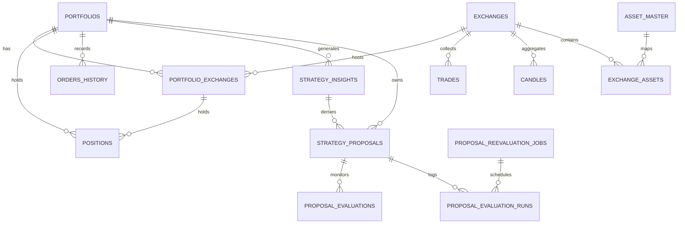
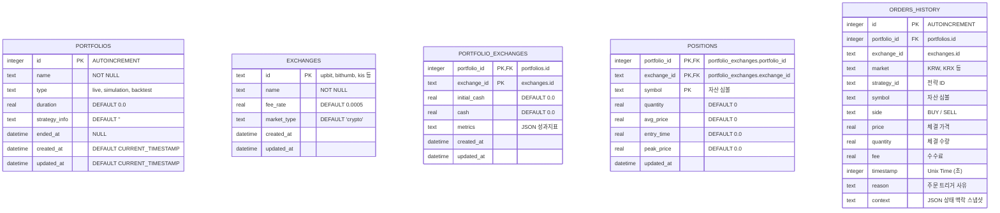
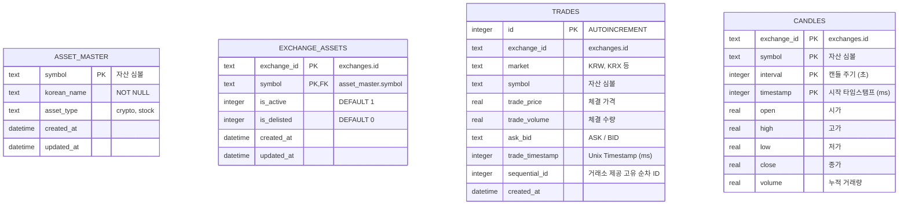

# 데이터베이스 ERD 명세서 (ERD Specification)

이 문서는 통합 실시간 매매 시스템(ATS)의 SQLite 데이터베이스 스키마 간의 Entity-Relationship Diagram(ERD)과 관계성을 정의합니다. 

이 문서의 다이어그램은 **Mermaid** 문법으로 작성되었습니다. Mermaid를 지원하는 마크다운 뷰어(예: GitHub, VSCode Mermaid 확장 등)를 통해 시각적으로 조회할 수 있습니다.

---

## 1. 개략적 관계도 (High-Level Entity Relationship Diagram)

시스템의 테이블 간 관계를 거시적으로 나타낸 다이어그램입니다. 포트폴리오를 중심으로 주문/포지션이 묶이고, 거래소 정보와 자산 마스터 정보가 수집용 데이터(`trades`, `candles`, `exchange_assets`)와 연동됩니다.

---

## 2. 테이블별 상세 엔티티 구조 (Entity Attributes Specification)

### 2.1. 사용자 및 자산 코어 영역

### 2.2. 시장 시세 및 수집 영역

### 2.3. AI 가설 및 제안 사후 평가 영역

```mermaid
erDiagram
    STRATEGY_INSIGHTS {
        integer id PK "AUTOINCREMENT"
        integer portfolio_id FK "portfolios.id"
        text strategy_id "전략 ID"
        text category "STOP_LOSS, TRAILING_STOP 등"
        text fact_summary "인사이트 텍스트 요약"
        text details_json "JSON 상세 통계 지표"
        datetime created_at
    }

    STRATEGY_PROPOSALS {
        integer id PK "AUTOINCREMENT"
        integer insight_id FK "strategy_insights.id"
        text proposal_group_id "제안 그룹 식별자"
        integer version "제안 버전"
        integer portfolio_id FK "portfolios.id"
        text strategy_id "전략 ID"
        text status "PENDING, APPROVED 등"
        text outcome "RUNNING, COMPLETED 등"
        text original_params "JSON 변경 전 파라미터"
        text proposed_params "JSON 제안 파라미터"
        text metrics "JSON 백테스트 성과 지표"
        text mutation_trace "JSON 변형 추적 이력"
        integer confidence_score "신뢰도 점수 (0~100)"
        integer applied_at "적용 완료 밀리초 시각 (ms)"
        integer rolled_back_at "롤백 처리 밀리초 시각 (ms)"
        text decision_path_hash "의사결정 해시"
        text audit_log_json "JSON 채점 및 다양성 규제 로그"
        real counterfactual_roi "반사실적 가상 ROI (%)"
        real counterfactual_mdd "반사실적 가상 MDD (%)"
        integer is_counterfactual_tracked "반사실적 가상 성과 추적 여부"
        datetime created_at
        datetime updated_at
    }

    PROPOSAL_EVALUATIONS {
        integer id PK "AUTOINCREMENT"
        integer proposal_id FK "strategy_proposals.id"
        text horizon_name "10m, 30m 등"
        real candidate_roi "후보 전략 누적 ROI"
        real champion_roi "챔피언 전략 누적 ROI"
        real roi_gap "ROI 편차"
        real candidate_mdd "후보 전략 누적 MDD"
        real champion_mdd "챔피언 전략 누적 MDD"
        integer virtual_rollback "가상 롤백 트리거 여부"
        text actual_label "GOOD / BAD"
        text actual_label_source "레이블 결정 상세 원인 정보"
        integer due_at "평가 만기 타임스탬프"
        integer evaluated_at "평가 완료 타임스탬프"
        text evaluation_status "PENDING, EVALUATING, COMPLETED 등"
        text horizon_type "elapsed, session 등"
        integer horizon_value "Horizon 값 (초)"
        text policy_version "EvaluationPolicyRouter 버전"
        text scorer_version "GIRSScorer 모델 버전"
        real predicted_risk_score "예측된 섀도 리스크 점수"
        integer locked_at "원자적 선점용 락 타임스탬프"
        integer retry_count "재시도 횟수"
        text last_error "마지막 실패 에러 로그"
        datetime created_at
    }

    PROPOSAL_REEVALUATION_JOBS {
        integer job_id PK "AUTOINCREMENT"
        integer proposal_id "strategy_proposals.id"
        text status "QUEUED, RUNNING, COMPLETED 등"
        integer requested_at "요청 Unix epoch ms"
        integer started_at "시작 타임스탬프"
        integer finished_at "완료/실패 타임스탬프"
        text requested_by "user, system 등"
        text mode "재평가 모드"
        integer input_snapshot_id "FeatureSnapshot ID"
        text error_message "실패 시 오류 메시지"
        text worker_id "처리 데몬 식별자"
    }

    PROPOSAL_EVALUATION_RUNS {
        integer evaluation_run_id PK "AUTOINCREMENT"
        integer proposal_id "strategy_proposals.id"
        integer job_id "proposal_reevaluation_jobs.job_id"
        real girs_score "GIRS 모델 리스크 점수"
        real promotion_score "최종 승격 심사 점수"
        real stability_score "종합 안정성 점수"
        real rollback_probability "롤백 위험 확률 추정값"
        integer data_quality_blocked "데이터 품질 차단 여부"
        integer counterfactual_result_id "연결된 proposal_evaluations ID"
        text model_version "GIRS 모델 버전"
        text scorer_version "Scorer 버전"
        text simulator_version "백테스트 시뮬레이터 버전"
        integer created_at "생성 Unix epoch ms"
    }
```

---

## 3. 외래키 및 제약조건 관계성 요약

1. **`portfolios` (1 : N) `portfolio_exchanges`**
   * 한 포트폴리오는 복수의 거래소 자산을 동시에 가질 수 있습니다.
   * `ON UPDATE CASCADE ON DELETE CASCADE` 제약조건을 가져 포트폴리오 삭제 시 잔고도 삭제됩니다.
2. **`portfolio_exchanges` (1 : N) `positions`**
   * 거래소별 세부 포트폴리오 잔고 하에 실제 종목들의 보유 수량과 단가가 기록됩니다.
   * `(portfolio_id, exchange_id)` 복합 외래키가 구성됩니다.
3. **`strategy_insights` (1 : N) `strategy_proposals`**
   * 분석된 전략적 손실 등의 원인 인사이트를 해결하기 위해 여러 파라미터 개선 제안이 도출될 수 있습니다.
4. **`strategy_proposals` (1 : N) `proposal_evaluations`**
   * 하나의 파라미터 제안에 대해 `10m`, `30m`, `1d` 등 다양한 시간 Horizon 별로 가상/실제 사후 성과 평가 레코드가 추적됩니다.
5. **`strategy_proposals` (1 : N) `proposal_evaluation_runs`**
   * 수동 재평가 Job이 완료될 때마다 append-only로 승격 점수 변화 이력이 이 테이블에 누적 기록됩니다.
