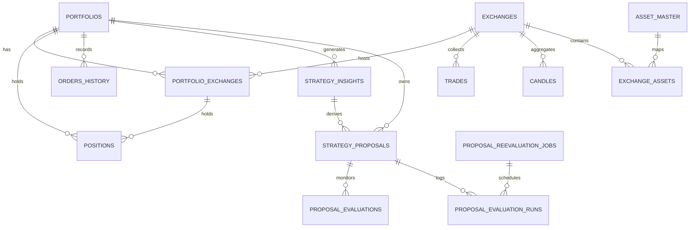
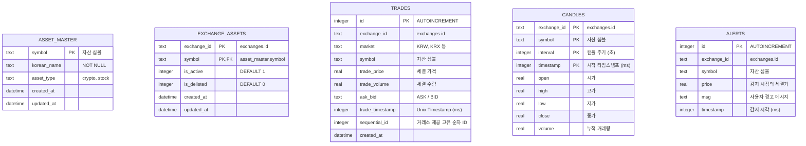

# 데이터베이스 ERD 명세서 (ERD Specification)

이 문서는 통합 실시간 매매 시스템(ATS)의 SQLite 데이터베이스 스키마 간의 Entity-Relationship Diagram(ERD)과 각 테이블 및 관계성에 대한 상세 명세를 다룹니다.

이 문서의 다이어그램은 **Mermaid** 문법으로 작성되었습니다. Mermaid를 지원하는 마크다운 뷰어(예: GitHub, VSCode Mermaid 확장 등)를 통해 시각적으로 조회할 수 있습니다.

---

## 1. 개략적 관계도 (High-Level Entity Relationship Diagram)

시스템의 테이블 간 관계를 거시적으로 나타낸 다이어그램입니다. 포트폴리오를 중심으로 주문/포지션이 묶이고, 거래소 정보와 자산 마스터 정보가 수집용 데이터(`trades`, `candles`, `exchange_assets`)와 연동됩니다.

---

## 2. 테이블별 상세 엔티티 구조 및 한글 설명 (Entity Attributes & Descriptions)

### 2.1. 사용자 및 자산 코어 영역
사용자의 투자 계정(포트폴리오), 연결 거래소 잔고, 보유 중인 자산 포지션 및 거래 집행 이력을 관리하는 핵심 영역입니다.

* **`portfolios` (시뮬레이션 포트폴리오 마스터)**: 백테스트 및 실시간 거래 시뮬레이션 과정에서 운용되는 포트폴리오의 마스터 정보를 관리합니다.
* **`exchanges` (거래소 마스터)**: 시스템 내부에서 처리하는 시장/거래소 정보(수수료율, 자산군 분류)를 저장합니다.
* **`portfolio_exchanges` (포트폴리오-거래소 맵 및 세부 잔고)**: 하나의 포트폴리오가 복수의 거래소 자산을 동시에 보유/관리할 수 있도록 보장하는 중간 매핑 테이블로, 거래소별 운용 가능한 현재 현금과 성과 지표(MDD, 승률, 누적수익률 등)를 JSON 포맷으로 관리합니다.
* **`positions` (보유 자산 포지션)**: 포트폴리오가 현재 실시간/가상으로 보유 중인 자산 목록(수량, 평균 단가, 진입 당시 도달 최고가 등)을 상세 기록합니다.
* **`orders_history` (주문 내역 이력)**: 가상/실제 매매 집행 과정에서 발생한 모든 주문 내역(매수/매도 구분, 가격, 수량, 수수료, 체결 사유 등)을 이력 관리합니다.

---

### 2.2. 시장 시세 및 수집 영역
실시간으로 거래소로부터 수집되는 틱 데이터와 가변 시간 프레임으로 가공되는 캔들 정보, 거래소별 감시 활성 대상 자산군을 제어합니다.

* **`asset_master` (전체 자산 정보 마스터)**: 전체 거래 대상 자산의 메타데이터와 국가별 한글명(예: 삼성전자, 비트코인 등)을 일괄 매핑 및 캐시하여 관리합니다.
* **`exchange_assets` (거래소별 취급 자산 관리)**: 각 거래소에서 수집/전략 감시를 수행할 활성 종목 여부(`is_active=1`) 및 상장 폐지 여부(`is_delisted=1`) 상태를 설정합니다.
* **`trades` (실시간 틱 데이터)**: 거래소로부터 실시간 수신한 개별 체결(Tick) 내역을 저장합니다.
* **`candles` (OHLCV 캔들스틱 데이터)**: 틱 데이터를 가변 인터벌(1초, 5초, 1분 등) 단위로 변환 및 취합한 역사적 캔들 정보입니다.
* **`alerts` (급등락 실시간 알림)**: 실시간 가격 급등락(Spike) 감지 또는 특정 기술 지표 조건 돌파 시 발생한 이벤트를 기록합니다.

---

### 2.3. AI 가설 및 제안 사후 평가 영역
AI 모델을 활용해 손실 원인을 분석하고, 최적의 파라미터 개선을 제안하며, 다중 시간축(Horizon) 및 수동 시뮬레이션을 통해 성과 오차와 롤백 여부를 평가 및 추적합니다.

* **`strategy_insights` (분석 통계 인사이트)**: 손실 거래 데이터 분석을 바탕으로 하여 어떤 유형(손절매, 타임아웃, 진입 필터 등)의 규칙이 부적합했는지 AI가 추론해 낸 통계 인사이트를 영속화합니다.
* **`strategy_proposals` (전략 파라미터 개선 제안)**: 통계 분석 및 섀도 백테스트 검증을 거친 후 적용을 앞두고 있는 파라미터 개선 제안들의 목록과 가상/실전 성패 결과를 관리합니다.
* **`proposal_evaluations` (제안 사후 성과 평가)**: 승인된 제안이나 후보 전략들에 대해 여러 Horizon 시각 기준(만기 시점 `due_at`)에 맞추어 실제 시장에서 롤백 기준에 부합했는지를 사후 평가 FSM 상태(`PENDING`, `EVALUATING`, `COMPLETED`)를 통해 기록합니다.
* **`proposal_reevaluation_jobs` (수동 재평가 Job Queue)**: 사용자가 의사결정 콘솔 UI에서 재평가를 요청하면 비동기로 동작하는 백그라운드 Job 큐로, 데몬이 이를 순차 감지하여 처리합니다.
* **`proposal_evaluation_runs` (수동 재평가 점수 누적 이력)**: 수동 재평가 결과 완료 시 생성되는 이력 테이블로, 시간에 따라 GIRS 리스크 점수나 안정성 점수 변화 추이를 추적할 수 있도록 돕습니다.

---

### 2.4. 전략 파라미터 버전 관리 및 시스템 운영 영역
전략 파라미터 롤백 및 변이 히스토리를 추적하고, 시스템 감사 로그 및 리스크 관리 피처들을 취합합니다.

```mermaid
erDiagram
    STRATEGY_VERSIONS {
        text strategy_id PK "전략 고유 ID"
        integer current_version_id "현재 활성 버전 번호"
        text current_params "현재 적용 중인 파라미터 JSON"
        integer rollback_source_version "롤백 유발 버전 ID"
        integer applied_at "적용 밀리초 시각 (ms)"
        datetime updated_at
    }

    STRATEGY_PARAMETER_HISTORY {
        integer id PK "AUTOINCREMENT"
        text strategy_id "전략 ID"
        integer version_id "버전 번호"
        integer parent_version_id "부모 버전 번호"
        text old_params "변경 전 파라미터 JSON"
        text new_params "변경 후 파라미터 JSON"
        integer proposal_id "연관된 승인 제안 ID"
        integer is_current "현재 활성 버전 여부 (0/1)"
        text changed_by "변경 주체 (USER/AUTO)"
        text change_reason "변경 상세 사유"
        datetime created_at
    }

    STRATEGY_PERFORMANCE_SNAPSHOTS {
        integer id PK "AUTOINCREMENT"
        text strategy_id "대상 전략 ID"
        integer version_id "성과 측정 대상 전략 버전"
        text parameter_hash "파라미터 JSON 해시값"
        text snapshot_type "PERIODIC, ROLLBACK, STARTUP 등"
        integer timestamp "기록 시점 타임스탬프 (ms)"
        real roi "누적 ROI (%)"
        real mdd "누적 Max Drawdown (%)"
        real profit_factor "Profit Factor"
        real win_rate "승률 (%)"
        integer trade_count "체결 거래 건수"
        datetime created_at
    }

    MARKET_REGIME_SUMMARIES {
        integer id PK "AUTOINCREMENT"
        integer timestamp "1분 주기 버킷 타임스탬프 (ms)"
        text symbol "exchange:symbol 형식"
        real volatility "변동성 표준편차 비율"
        real rsi "1분봉 기준 14분 RSI"
        real volume_ratio "최근 20분 평균 대비 직전 1분 거래량 비율"
        real spread "1분간 체결 스프레드 비율"
        real orderbook_imbalance "1분간 호가 불균형 비율"
        datetime created_at
    }

    GIRS_SHADOW_METRICS {
        integer id PK "AUTOINCREMENT"
        real timestamp "기록 시점 타임스탬프 (초)"
        text proposal_id "대상 승격 제안 ID"
        text strategy_id "대상 전략 ID"
        real model_risk_score "GIRS 모델 리스크 점수"
        real fallback_risk_score "룰 기반 폴백 리스크 점수"
        real final_promotion_score "최종 승격 심사 점수"
        real shadow_risk_score "섀도 운용 리스크 점수"
        real replay_drift "리플레이 시뮬레이션 편차"
        integer correction_active "드리프트 보정 활성화 여부 (0/1)"
        text operation_mode "시스템 운영 모드"
        text model_version "GIRS 모델 버전"
        text scaler_version "GIRS 스케일러 버전"
        integer strategy_version_id "활성 전략 버전 번호"
        text simulation_session_id "모의투자 세션 ID"
        text decision_type "SHADOW / LIVE"
        text blocked_reason "승격 차단 사유"
        integer trade_age_ms "시세 수신 지연 연령"
        integer orderbook_age_ms "호가 수신 지연 연령"
        integer indicator_age_ms "지표 계산 지연 연령"
        integer is_fresh "데이터 신선도 충족 여부 (0/1)"
        text stale_reason "데이터 만료 상세 사유"
        text snapshot_version "피처 스냅샷 DTO 스키마 버전"
        text snapshot_hash "피처 구조체 직렬화 해시"
        text feature_vector_hash "실 수치 벡터 직렬화 해시"
        integer orderbook_available "호가 가용 상태 여부"
        text market_type "crypto / stock"
        text session_state "세션 운영 레짐"
        text volatility_regime "변동성 상태 분류"
        text liquidity_regime "유동성 상태 분류"
        text exchange_id "거래소 ID"
    }

    UNIVERSE_GUARD_STATE {
        text exchange_id PK "대상 거래소 ID"
        text market_type PK "crypto / stock"
        text symbol PK "대상 종목 심볼"
        text status "감시 상태"
        text blocked_reason "차단 사유"
        integer blocked_count "누적 차단 횟수"
        real last_blocked_at "마지막 차단 타임스탬프"
        text last_event_logged_reason "마지막으로 기록된 차단 사유"
    }

    SYSTEM_EVENTS {
        integer id PK "AUTOINCREMENT"
        text event_type "NOT NULL"
        text target "NOT NULL"
        text message "이벤트 상세 로그"
        integer timestamp "로컬 밀리초 타임스탬프 (ms)"
        text context "JSON 맥락 데이터 및 command_id"
    }
```

* **`strategy_versions` (전략 활성 버전 마스터)**: 각 매칭 전략별 현재 서비스 상에서 활성화되어 구동 중인 버전 번호와 실제 파라미터 JSON 문자열을 보관합니다.
* **`strategy_parameter_history` (전략 파라미터 변경 이력)**: 사용자의 수동 변경이나 자동 AI 승격 제안 적용, 롤백 등으로 인한 전략 파라미터 변경 이력과 버전 분기 계보(부모 버전 ID)를 계통 관리합니다.
* **`strategy_performance_snapshots` (전략 성과 스냅샷)**: 기동 시점이나 롤백 시점 등 이벤트가 일어난 시점별 누적 ROI, MDD, 승률, 누적 거래 건수 등의 리스크 지표 스냅샷을 관리합니다.
* **`market_regime_summaries` (시장 상태 요약 피처)**: 거시적인 시장 특성을 1분 주기로 요약(RSI, 변동성 표준편차 비율, 호가 불균형 비율 등)하여 가설 수립 및 분석용 피처로 활용합니다.
* **`girs_shadow_metrics` (GIRS 섀도 지표)**: 섀도 모니터링 시 매 루프마다 산출된 모델 리스크 점수, 데이터 가용성 신선도, 리플레이 시뮬레이션 편차(Drift)를 실시간으로 기록합니다.
* **`universe_guard_state` (유니버스 가드 상태)**: 쿨다운이나 쿼터 제한 등으로 인해 실시간 유니버스에서 차단된 상태인지 여부와 누적 차단 횟수를 관리합니다.
* **`system_events` (시스템 및 데몬 운영 이력)**: 사용자 수동 조작 감사 로그(`_REQUEST`, `_SUCCESS`, `_FAILED` 세트), 데몬 프로세스 기동/종료, 수집기 에러 및 크래쉬 감지 등 운영 이력을 영속화합니다.

---

## 3. 핵심 외래키 및 무결성 제약조건 관계성

1. **`portfolios` (1 : N) `portfolio_exchanges`**
   * 관계: 한 포트폴리오는 여러 거래소의 자산과 잔고를 보유할 수 있습니다.
   * 제약: `ON UPDATE CASCADE ON DELETE CASCADE` 설정으로 포트폴리오 마스터가 삭제되면 세부 자산 잔고 정보도 자동으로 안전하게 지워집니다.
2. **`portfolio_exchanges` (1 : N) `positions`**
   * 관계: 거래소 세부 포트폴리오 잔고 하에 다중 자산 포지션이 존재합니다.
   * 제약: 외래키로 `(portfolio_id, exchange_id)` 복합키 조합을 사용하여 정합성을 이중으로 보호합니다.
3. **`strategy_insights` (1 : N) `strategy_proposals`**
   * 관계: AI가 식별해 낸 특정 거래 손실 분석 인사이트(`insight_id`)를 해소하기 위해 복수의 파라미터 개선안이 제안될 수 있습니다.
4. **`strategy_proposals` (1 : N) `proposal_evaluations`**
   * 관계: 개선 제안 파라미터의 타당성과 오차를 분석하기 위해, 1개의 제안에 대하여 `10m`, `30m`, `1d` 등 N개의 서로 다른 시간 Horizon 별 평가 FSM이 구성됩니다.
5. **`strategy_proposals` (1 : N) `proposal_evaluation_runs`**
   * 관계: 수동 시뮬레이션 요청에 연관된 Job이 완료될 때마다 append-only 형태로 승격 점수 변화 이력이 이 테이블에 누적됩니다.
6. **`proposal_reevaluation_jobs` (1 : N) `proposal_evaluation_runs`**
   * 관계: 사용자가 요청한 각 수동 재평가 작업(`job_id`) 결과가 실제 완료되었을 때의 추론 점수 및 시뮬레이션 결과와 매핑됩니다.
